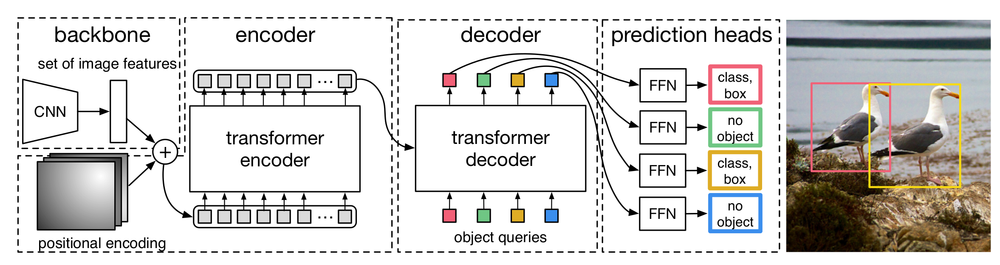

以下是修改后的文章，所有公式均已调整为 `$...$` 格式，内容保持不变：

# DETR论文模型详解

> 目标检测的“清流”：扔掉锚点、NMS，用Transformer端到端搞定一切

如果你熟悉Faster R-CNN、YOLO这些经典检测器，一定对锚点（anchor）、非极大值抑制（NMS）、规则化的目标分配这些“手工组件”又爱又恨。它们确实有效，但也不断堆砌着超参数和设计陷阱。
直到2020年，Facebook AI推出的**DETR**（Detection Transformer）用一种近乎“叛逆”的方式重新思考了目标检测——**把检测当作一个集合预测问题**，采用并行解码技术用Transformer的编码器-解码器结构直接输出所有目标框和类别。没有anchor，没有NMS，甚至没有候选区域。
这篇文章，我们就从**模型设计**的角度，一步步拆解DETR到底是怎么工作的，以及它相比Faster R-CNN到底强在哪、弱在哪。

---

## 一、痛点：传统检测器的“手工味儿”太重

像Faster R-CNN、YOLOv3这样的主流检测器，背后依赖着一大堆**人为设计的组件**：
- **锚点（anchor）**：需要预设尺寸、宽高比，不同数据集要精心调参。
- **训练目标分配**：基于IoU的硬性规则决定哪个anchor负责哪个目标。
- **后处理NMS**：过滤冗余框，又是一个超参数敏感的步骤。

这些组件虽然有效，但让整个模型变得复杂、不优雅，而且**并非端到端可学习**。DETR的核心创新就是：**用Transformer的集合预测能力，一步到位输出最终检测结果**，彻底绕过上述所有手工设计。

---

## 二、模型解读：从输入到输出，完全解剖DETR

参考图1的结构，DETR可以清晰地拆分为三个部分：**Backbone** → **Transformer** → **Prediction Heads**。我们按照数据流动的方向逐一讲解。

**图1 DETR模型架构**

### 1. Backbone：CNN提取基础特征

**输入**：原始图像 $x \in \mathbb{R}^{3 \times H_0 \times W_0}$，比如 $3\times 800\times 1066$。  
**输出**：下采样后的特征图 $f \in \mathbb{R}^{C \times H \times W}$，其中 $C=2048$，$H=H_0/32$，$W=W_0/32$。

DETR的backbone就是一张标准的卷积神经网络（如ResNet-50），提取空间特征。这一步没有任何创新，但有一个关键操作：**将二维特征图展平为一维序列**，送入Transformer。也就是说，特征图的每个位置（总共 $H\times W$ 个点）变成Transformer的一个输入token，每个token的维度是 $C$。

**为什么要展平？** Transformer天生处理序列，我们需要把空间网格转成序列。同时，为了保留位置信息，必须加上**位置编码**（后面会讲）。

> 💡 比喻：backbone像一个“画家”，先用粗线条把图像的主要纹理和轮廓画下来（下采样），然后剪成一条长纸条（展平），准备送给Transformer。

### 2. Transformer：编码器-解码器建模全局关系

这是DETR的**灵魂**，这里是采用的是标准的transform架构，下面我们详细介绍一下输入输出、关键设计和创新点。

#### 2.1 编码器（Encoder）

**输入**：backbone输出的特征序列（维度 $d=2048$）+ **空间位置编码**。  
位置编码采用标准Transformer的**正弦余弦编码**，但这里是在二维网格上独立编码行列位置，然后叠加。在 DETR 中，位置编码的核心思想是：将二维特征图的每个像素点 (行, 列) 视为一个独立的位置，分别对行坐标和列坐标采用标准 Transformer 的正弦余弦编码，然后把两个编码向量逐元素相加，作为该点的最终位置编码。 
**输出**：同样长度的特征序列，维度保持 $d$，但已经过自注意力建模了全局上下文。

编码器由多个相同的层堆叠（默认6层），每层包含一个**多头自注意力**和一个**前馈网络**（FFN）。自注意力的作用：让每个特征点“看到”所有其他特征点，从而融合全局信息。例如，远处的相似物体能互相增强特征，被遮挡的部分也能借助周围背景推断。

#### 2.2 解码器（Decoder）

**输入**：  
- **编码器的输出**（作为Key和Value）  
- **Object queries**（作为初始的Query）—— 这是DETR最巧妙的设计。

**Object queries** 是什么？ 它是一组**可学习的参数**，形状为 $N \times d$，其中 $N$ 是模型能预测的最大物体数（例如100）。每个query向量相当于一个“空槽位”，训练过程中会逐渐学会**对应不同位置、不同尺寸的物体**。你可以把它们理解为**没有物理意义的“检测先验”**，不像anchor那样有固定形状。

**过程**：解码器也堆叠6层，每层做**交叉注意力**（query来自object queries，key/value来自编码器输出）和**自注意力**（避免多个query输出重复物体）。最终，解码器输出 $N$ 个特征向量，每个向量对应一个query的“最终表达”。

> 💡 比喻：object queries就像100个“探测器”，每个探测器会在训练中自发学会“关注”图像中某个区域的某种物体（比如左上角的大狗、右下角的小车）。解码器就是让这些探测器结合图像特征，逐步“聚焦”到它们负责的目标上。

#### 2.3 创新点总结
- **没有anchor**：用可学习的query替代手工anchor。
- **没有NMS**：解码器自注意力会让不同query输出不同的物体（抑制冗余），推理时直接输出所有query的结果，按置信度阈值过滤即可。
- **全局建模**：编码器自注意力让模型能理解整个图像的关系，这对遮挡和重叠物体特别有用。

### 3. Prediction Heads：生成框和类别

**输入**：解码器输出的 $N$ 个特征向量（每个 $d$ 维）。  
**输出**：$N$ 个预测结果，每个包含：
- **类别概率**：通过一个线性层 + Softmax，输出 $K+1$ 类（$K$ 个目标类 + 1 个“无物体”类）。
- **边界框坐标**：通过一个3层MLP（带ReLU）回归出 $(cx, cy, w, h)$，归一化到[0,1]。

至此，模型输出 $N$ 个无序的检测结果。训练时，我们需要把**这些预测和真实标签进行匹配**，这就是**二分匹配损失**（Hungarian算法）。匹配完成后，计算分类的交叉熵损失和框的L1 + GIoU损失。这套损失函数天然不需要NMS，因为匹配过程强制每个真值只匹配一个预测，多余的预测会被分配到“无物体”类。

---

## 三、与Faster R-CNN的三点核心对比

| 对比维度 | DETR | Faster R-CNN | 结论 |
|---------|------|--------------|------|
| **模型复杂度** | 参数量稍大（~41M vs 40M），但**计算量显著更高**，尤其Transformer的全局注意力复杂度 $O(H^2W^2)$，训练速度慢2-3倍。 | 区域建议网络（RPN）和卷积特征金字塔（FPN）计算效率较高，尤其对小分辨率特征图友好。 | DETR更“重”，不适合实时场景。 |
| **检测精度** | 在COCO上**大、中物体精度接近甚至超过Faster R-CNN**，但对**小物体**精度下降明显（因为下采样16倍后小物体特征丢失严重）。 | 依靠FPN多尺度特征，小物体检测天然占优。 | DETR更适合稀疏、大物体场景。 |
| **后处理依赖** | **完全不需要NMS**，也没有anchor调参，真正端到端。 | 依赖NMS（阈值敏感）和精心设计的anchor（尺寸、比例）。 | DETR简化了流程，更优雅。 |

---

## 运行结果
autodrv-SetCriterion-HungarianMatcherindices: [(tensor([30, 44]), tensor([1, 0])), (tensor([18, 21, 26, 34, 57, 59, 71, 79, 94]), tensor([3, 0, 4, 7, 5, 8, 6, 1, 2]))]

## 四、简单结论

**创新与里程碑意义**：  
DETR首次将Transformer用于目标检测的**集合预测**框架，彻底抛弃了锚点、NMS等手工组件，让检测器变得简洁而统一。它证明了**序列建模与二分匹配可以替代复杂的规则设计**，开启了后续Deformable DETR、DINO等一系列改进工作的序幕。

**不可回避的缺点**：  
- **小目标检测能力弱**（由于CNN下采样丢失细节）。  
- **训练收敛极慢**：Transformer需要500个epoch才能达到较好效果（改进版如Deformable DETR缓解了此问题）。  
- **大分辨率图像计算量爆炸**（自注意力复杂度平方增长）。

尽管有这些不足，DETR的思想依然是革命性的。如果你想理解**Transformer如何从NLP跨界到视觉**，DETR是最好的起点。至于实际工程落地，请移步它的后代们——但那又是另一个故事了。