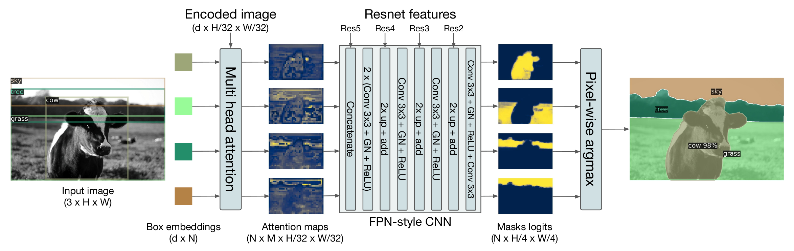
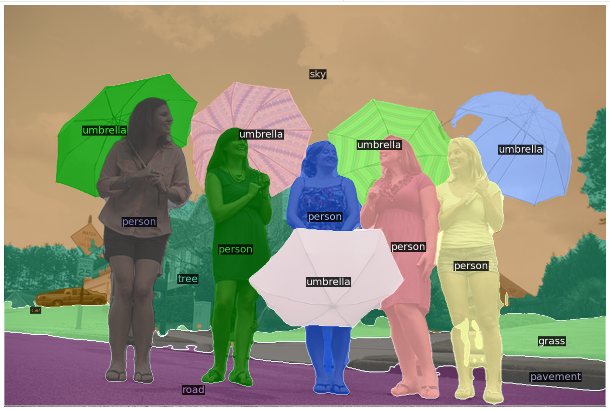

# DETR目标检测和全景分割的检测头是如何设计的

> 从边界框到像素级掩码，拆解Transformer如何“一笔画出”全景分割

如果你已经熟悉Faster R-CNN的RPN头、YOLO的网格预测头，那么面对DETR这种“端到端”的检测器，你可能会好奇：**没有了Anchor和NMS，它的检测头到底长什么样？** 更神奇的是，DETR还能通过**同一个Transformer解码器**同时做全景分割——仅仅在目标检测头上“嫁接”两个模块，就能输出像素级的`thing`（有固定形状的物体）和`stuff`（无定形背景）掩码。

今天，我们就以DETR官方实现（Facebook Research）的代码为蓝本，彻底拆解**目标检测头**和**全景分割头**的设计细节。

---

## 一、DETR要解决什么问题？

- **目标检测**：给定一张图，输出若干边界框（`$x, y, w, h$`）及其类别（比如“猫”、“车”）。传统方法依赖密集Anchor和NMS后处理。
- **全景分割**：目标检测的“高配版”——不仅要框出每个物体，还要给图像中的**每个像素**分配一个语义标签，同时区分不同实例（`thing`类）和背景（`stuff`类）。

DETR用一个**Transformer解码器**同时完成两项任务：解码器输出100个查询（`num_queries=100`），每个查询对应一个潜在的物体或区域。目标检测头把这些查询“翻译”成框和类别；全景分割头则在此基础上额外预测掩码。

---

## 二、目标检测头：简单得让人不敢相信

DETR的检测头没有Anchor，没有RPN，没有NMS。它只由两个组件构成：**分类头**和**框回归头**，都挂在Transformer解码器的输出上。

### 1. 分类头：线性层 + 匈牙利匹配

```python
self.class_embed = nn.Linear(hidden_dim, num_classes + 1)
```

- `hidden_dim = 256`（Transformer模型的维度）
- `num_classes`：COCO是91（包括背景？不，这里的`num_classes+1`指的是**真实类别数 $+1$ 个“无物体”类**。代码注释中明确写着：“including no-object category”）

每个查询经过解码器后得到一个256维的特征向量`hs`（形状`$[num\_queries, batch, 256]$`），分类头将其映射到 `$(num\_classes+1)$` 维的logits。最后的 `no-object` 类别用于表示“这个查询没有对应任何物体”——这替代了NMS的功能。

**关键设计**：损失计算采用**匈牙利匹配**，而不是直接对所有查询计算损失。在`SetCriterion.loss_labels`中：

```python
# 按照匹配索引indices，从目标中提取对应的类别标签
target_classes_o = torch.cat([t["labels"][J] for t, (_, J) in zip(targets, indices)])
# 填充为no-object类别
target_classes = torch.full(src_logits.shape[:2], self.num_classes, ...)
target_classes[idx] = target_classes_o
# 交叉熵损失，对no-object类别单独降权（eos_coef=0.1）
loss_ce = F.cross_entropy(src_logits.transpose(1, 2), target_classes, self.empty_weight)
```

**比喻**：匈牙利匹配像“相亲配对”——为每个真实物体找到最匹配的查询，其余查询统统标记为“单身”（no-object）。这样训练出来的分类头自然学会抑制冗余框。

### 2. 框回归头：MLP + Sigmoid

```python
self.bbox_embed = MLP(hidden_dim, hidden_dim, 4, 3)
# MLP定义: input_dim -> hidden_dim -> ... -> output_dim, 共num_layers层
```

- **结构**：3层全连接（$256 \rightarrow 256 \rightarrow 256 \rightarrow 4$），每层之间用ReLU激活。
- **输出**：4维向量 `$(cx, cy, w, h)$`，经过`sigmoid()`压缩到 `$[0,1]$`，表示相对于原图尺寸的归一化坐标。

为什么用MLP而不是简单的线性层？因为边界框回归是**几何变换**，需要一定的非线性表达能力。实验证明3层MLP比单层线性层精度更高。

**损失**：`loss_bbox`（L1损失） + `loss_giou`（GIoU损失）。GIoU弥补了L1对尺度不敏感的缺陷。

```python
loss_bbox = F.l1_loss(src_boxes, target_boxes, reduction='none')
loss_giou = 1 - torch.diag(box_ops.generalized_box_iou(...))
```

检测头整体就是如此简单：一个线性层做分类，一个3层MLP做框回归。没有边界框的“微调头”，也没有分类的“置信度校准”。这种极简设计正是Transformer统一架构的魅力。

---

## 三、全景分割头：在检测头上“嫁接”注意力与上采样


**图1 全景分割头设计**

全景分割头并不是另起炉灶，而是在**目标检测头的基础上增加了两个新模块**（见图1，图中展示了从检测头、注意力图到上采样卷积的流程）：

1. **多头交叉注意力模块**（`MHAttentionMap`）——只计算注意力权重，不乘V。
2. **CNN上采样模块**（`MaskHeadSmallConv`）——类似FPN，融合多尺度特征。

整体代码实现：

```python
class DETRsegm(nn.Module):
    def __init__(self, detr, freeze_detr=False):
        self.detr = detr
        hidden_dim, nheads = detr.transformer.d_model, detr.transformer.nhead
        self.bbox_attention = MHAttentionMap(hidden_dim, hidden_dim, nheads, dropout=0.0)
        self.mask_head = MaskHeadSmallConv(hidden_dim + nheads, [1024, 512, 256], hidden_dim)
```

### 1. 训练策略：两阶段训练更快更稳

官方提供两种训练方式：
- **方式一**：同时训练检测头（分类+框）和分割头（掩码）。
- **方式二（推荐）**：先训练检测头（300 epoch），**冻结检测头权重**，再单独训练分割头25个epoch。

为什么选方式二？论文指出：检测任务已经让模型学会了物体位置和类别；冻结后分割头只需学习如何从注意力图中“雕刻”出精确掩码，训练速度更快且最终精度几乎不下降。这就像先学会画轮廓，再学填色。

### 2. 关键组件一：多头交叉注意力（只算权重，不乘V）

代码中的`MHAttentionMap`类：

```python
class MHAttentionMap(nn.Module):
    """This is a 2D attention module, which only returns the attention softmax (no multiplication by value)"""
```

**它做了什么？**  
输入：
- `q`：解码器最后一层输出的查询特征（`$[num\_queries, batch, hidden\_dim]$`）
- `k`：编码器输出的记忆特征（`$[batch, hidden\_dim, H, W]$`）

计算注意力权重（而非标准注意力中的加权值）：

```python
weights = torch.einsum("bqnc,bnchw->bqnhw", qh * self.normalize_fact, kh)
weights = F.softmax(weights.flatten(2), dim=-1).view(weights.size())
return weights   # 形状: [batch, num_queries, nheads, H, W]
```

**为什么只输出权重，不乘V？**  
因为标准注意力中的 `V` 是编码器特征（`memory`），而这里我们**并不想聚合内容**——我们只需要知道“每个查询关注了特征图的哪些位置”。这些权重直接作为**空间注意力图**，后续会与FPN特征融合，指导掩码生成。换句话说，我们只取注意力分配的概率分布，而不是用这个分布去加权内容。这样既节省计算，又能获得纯净的空间响应图。

输出形状 `$[batch, num\_queries, 8, H/32, W/32]$`（8个注意力头）。每个头捕捉不同的空间关系（比如一个头关注物体中心，另一个头关注边界）。

### 3. 关键组件二：CNN上采样机制（类似FPN）

`MaskHeadSmallConv` 负责将**注意力图**与**多尺度CNN特征**融合，并逐级上采样到原图分辨率的1/4，最终输出每个查询的粗糙掩码。

#### （1）输入包括三部分

- **`x`**：骨干网络（ResNet）**最后一层**输出的特征图，形状为 `$[batch, 2048, H/32, W/32]$`，经 `self.detr.input_proj`（一个$1 \times 1$卷积）将通道数压缩到 `hidden_dim=256`，得到 `$[batch, 256, H/32, W/32]$`。  
  注意：这里是骨干网络的**最后一层**（分辨率最低，语义最强），而非编码器的输出，因为编码器的输出实际上在生成多头交叉注意力的时候已经使用了，这里没有必要再使用一次。

- **`bbox_mask`**：上面计算得到的注意力权重，形状 `$[batch, num\_queries, 8, H/32, W/32]$`。每个查询对应8个注意力头，每个头是一张空间响应图。

- **`fpns`**：ResNet骨干网络**前三层**的输出（`$[1024, 512, 256]$` 通道，分辨率依次为 `$H/16, H/8, H/4$`）。使用前三层是因为这里**分辨率更高**，包含丰富的**边缘和纹理细节**，这对生成精确掩码至关重要。

#### （2）如何融合8个注意力头的权重？

首先把 `x` 沿 `num_queries` 维复制，使其与 `bbox_mask` 的查询维度对齐：

```python
x = torch.cat([_expand(x, bbox_mask.shape[1]), bbox_mask.flatten(0, 1)], dim=1)
```

- `_expand(x, n)`：`x.unsqueeze(1).repeat(1, n, 1, 1, 1).flatten(0,1)`，结果形状为 `$[batch \times num\_queries, 256, H/32, W/32]$`。
- `bbox_mask.flatten(0,1)`：将 `$[batch, num\_queries, 8, H/32, W/32]$` 展平为 `$[batch \times num\_queries, 8, H/32, W/32]$`。

然后在通道维拼接，得到 `$[batch \times num\_queries, 256 + 8, H/32, W/32]$`。这里的 **264 = 256（骨干特征通道数）+ 8（注意力头数）**。**8个注意力头的权重图被当作8个独立的特征通道**，与骨干特征拼接后输入卷积层。这样设计的好处是：让卷积层自己学习如何根据不同头的空间响应来调整掩码生成——有些头可能关注物体中心，有些头关注边界，网络可以自适应地融合这些信息。

#### （3）上采样的网络结构：标准FPN的逐级相加融合

`MaskHeadSmallConv` 设计了5个卷积块（`lay1`~`lay5`），每个块包含 `Conv2d + GroupNorm(8) + ReLU`。同时，通过3个适配器（`adapter1`~`adapter3`，均为$1 \times 1$卷积）将FPN三层特征映射到对应的中间通道数，并**逐级相加**实现特征融合和上采样。

**这是标准FPN（Feature Pyramid Network）的典型做法**：将**高层语义特征**（经过几层卷积处理后的特征图）与**浅层高分辨率特征**（来自骨干网络前几层，保留丰富空间细节）通过加法融合。高层语义帮助模型知道“这是什么物体”，浅层细节帮助模型精确勾勒“物体的边缘在哪”。两者结合，使得上采样后的特征图**既有语义辨识能力，又有空间定位精度**。

**上采样路径（形状变化）**：

- 输入：`$[batch \times num\_queries, 264, H/32, W/32]$`
- `lay1` + `lay2`：保持分辨率，通道 $264 \rightarrow 128 \rightarrow 64$
- 与 `fpns[0]`（分辨率 `$H/16$`，经 `adapter1` 映射到64通道）相加，同时将当前特征图双线性上采样到 `$H/16$`：  
  `x = cur_fpn + F.interpolate(x, size=cur_fpn.shape[-2:], mode="nearest")`  
  这里的 `cur_fpn` 是浅层特征（分辨率更高），与上采样后的高层语义特征逐元素相加，实现FPN式的融合。
- `lay3`：处理 `$H/16$` 特征，通道 $64 \rightarrow 32$
- 与 `fpns[1]`（分辨率 `$H/8$`，经 `adapter2` 映射到32通道）相加，上采样到 `$H/8$`
- `lay4`：通道 $32 \rightarrow 16$
- 与 `fpns[2]`（分辨率 `$H/4$`，经 `adapter3` 映射到16通道）相加，上采样到 `$H/4$`
- `lay5` + `out_lay`：保持 `$H/4$`，通道 $16 \rightarrow 16 \rightarrow 1$

最终输出形状：`$[batch \times num\_queries, 1, H/4, W/4]$`，再通过 `view(bs, num_queries, H/4, W/4)` 得到每个查询的**粗糙掩码**。后续后处理（`PostProcessSegm` 或 `PostProcessPanoptic`）会将其双线性插值到原图分辨率。

**为什么不用转置卷积？** DETR采用双线性插值 + 相加的方式，简单稳定，避免棋盘格伪影。实验证明这种类FPN的设计在上采样分割任务中足够高效。

### 4. 全景分割结果分析（图2）


**图2 全景分割结果展示**

图2展示了DETR在COCO全景分割上的输出。观察要点：
- **`thing` 类（人、汽车、动物）**：每个实例有独立的颜色和边界框，掩码边缘清晰，尤其对重叠物体（比如两个人一前一后）仍能区分开——这得益于解码器的自注意力，不同查询会关注不同的人。
- **`stuff` 类（天空、草地、道路）**：被合并成连续的语义区域，没有实例分裂。注意图中天空和草地的过渡自然，没有锯齿感。
- **缺陷**：小物体（如远处的交通锥）偶尔丢失，因为下采样16倍后细节不足。这也是后续Mask2Former等模型改用多尺度可变形注意力的动机。

---

## 四、代码运行：从打印输出看全景分割头的数据流动

为了验证上述设计，我们在 `DETRsegm` 和 `MaskHeadSmallConv` 中加入了形状打印。下面是一次前向传播的实际输出，我们可以逐行解读数据是如何流过检测头和分割头的。

### 1. 模型初始化结构打印

```python
autodrv-DETRsegm-self.detr:DETR(
  (transformer): Transformer(...)   # 6层编码器+6层解码器，hidden_dim=256
  (class_embed): Linear(in_features=256, out_features=251, bias=True)
  (bbox_embed): MLP(
    (layers): ModuleList(
      (0-1): 2 x Linear(256, 256)
      (2): Linear(256, 4)
    )
  )
  (query_embed): Embedding(100, 256)
  (input_proj): Conv2d(2048, 256, kernel_size=1)
  (backbone): Joiner(...)  # ResNet-50
)
autodrv-DETRsegm-self.bbox_attention:MHAttentionMap(
  (dropout): Dropout(p=0.0)
  (q_linear): Linear(256, 256)
  (k_linear): Linear(256, 256)
)
autodrv-DETRsegm-self.mask_head:MaskHeadSmallConv(
  (lay1): Conv2d(264, 264, 3)
  (gn1): GroupNorm(8, 264)
  (lay2): Conv2d(264, 128, 3)
  ...
  (adapter1): Conv2d(1024, 128, 1)
  (adapter2): Conv2d(512, 64, 1)
  (adapter3): Conv2d(256, 32, 1)
  (out_lay): Conv2d(16, 1, 3)
)
```

- **目标检测头**：`class_embed` 输出 251 维（COCO全景分割类别数 250 $+1$ 个“无物体”类），`bbox_embed` 是 3 层 MLP 输出 4 维坐标。完全符合设计。
- **注意力模块**：`MHAttentionMap` 的 Q/K 线性层输入输出均为 256 维，8 个注意力头（`nheads=8`，但打印中未显式出现，由传入参数决定）。
- **分割头上采样模块**：第一个卷积层输入通道为 264，印证了 **264 = 256（骨干特征）+ 8（注意力头）**。后续通道逐级减半（$128 \rightarrow 64 \rightarrow 32 \rightarrow 16$），最终输出单通道掩码。

### 2. 前向传播中的张量形状变化

```python
autodrv-MaskHeadSmallConv-x:torch.Size([1, 256, 21, 42]), 
bbox_mask:torch.Size([1, 100, 8, 21, 42]), 
fpns:[torch.Size([1, 1024, 41, 84]), torch.Size([1, 512, 82, 167]), torch.Size([1, 256, 164, 333])]
```

- **`x`**：骨干最后一层（`layer4`）经 $1 \times 1$ 卷积投影后，形状 `$(1,256,21,42)$`。原图尺寸假设为 `$(672, 1344)$`，下采样 32 倍后得到 `$21 \times 42$`。
- **`bbox_mask`**：注意力模块输出的 8 头权重图，形状 `$(1,100,8,21,42)$` —— 100 个查询，每个查询有 8 张空间响应图。
- **`fpns`**：骨干前三层输出，分辨率依次为原图的 $1/16$（$41 \times 84$）、$1/8$（$82 \times 167$）、$1/4$（$164 \times 333$）。这些高分辨率特征将为上采样提供细节。

```python
autodrv-MaskHeadSmallConv-x.shape-1:torch.Size([100, 264, 21, 42])
```

- 将 `x` 复制 100 份（`_expand`）并与 `bbox_mask` 展平后在通道维拼接，得到 `$(100, 264, 21, 42)$`。**264 = 256 骨干特征 + 8 注意力头**，8 个头的权重作为独立通道送入卷积。

```python
autodrv-MaskHeadSmallConv-x.shape-2:torch.Size([100, 128, 21, 42])
```

- 经过 `lay1` 和 `lay2` 两层卷积（通道 $264 \rightarrow 128$），分辨率仍为 $21 \times 42$。此时特征图已融合了查询的注意力信息。

```python
autodrv-MaskHeadSmallConv-cur_fpn.shape-1:torch.Size([1, 128, 41, 84]), x.size(0):100, cur_fpn.size(0):1
autodrv-MaskHeadSmallConv-x.shape-3:torch.Size([100, 64, 41, 84])
```

- `adapter1` 将 `fpns[0]`（1024 通道，$41 \times 84$）映射到 128 通道，得到 `cur_fpn` 形状 `$(1,128,41,84)$`。由于 `x` 的 batch 为 100，需要将 `cur_fpn` 复制 100 份（`_expand`）。
- 当前 `x` 形状为 `$(100,128,21,42)$`，先上采样到 $41 \times 84$，再与 `cur_fpn` 相加（**FPN 首次融合**），然后经 `lay3` 卷积降维到 64 通道。分辨率提升到原图的 $1/16$。

```python
autodrv-MaskHeadSmallConv-cur_fpn.shape-2:torch.Size([1, 64, 82, 167])
autodrv-MaskHeadSmallConv-x.shape-4:torch.Size([100, 32, 82, 167])
```

- `adapter2` 将 `fpns[1]`（512 通道，$82 \times 167$）映射到 64 通道，上采样当前 `x`（64 通道，$41 \times 84$）到 $82 \times 167$，相加后经 `lay4` 降维到 32 通道。分辨率提升到 $1/8$。

```python
autodrv-MaskHeadSmallConv-cur_fpn.shape-3:torch.Size([1, 32, 164, 333])
autodrv-MaskHeadSmallConv-x.shape-4-1:torch.Size([100, 32, 164, 333])
autodrv-MaskHeadSmallConv-x.shape-4-2:torch.Size([100, 16, 164, 333])
autodrv-MaskHeadSmallConv-x.shape-5:torch.Size([100, 16, 164, 333])
autodrv-MaskHeadSmallConv-x.shape-6:torch.Size([100, 1, 164, 333])
```

- `adapter3` 将 `fpns[2]`（256 通道，$164 \times 333$）映射到 32 通道。当前 `x`（32 通道，$82 \times 167$）上采样到 $164 \times 333$ 后相加，经 `lay5` 降维到 16 通道。
- 最后 `out_lay` 输出单通道掩码，形状 `$(100, 1, 164, 333)$`。每个查询得到一张粗糙掩码，分辨率是原图的 $1/4$。

### 3. 小结：打印输出验证的设计要点

- **264 通道的由来**：骨干投影特征（256）与 8 个注意力头权重（8）拼接，使卷积层能同时利用语义特征和空间注意力分布。
- **FPN 逐级融合**：通过三次与骨干前三层特征相加，分辨率从 $1/32$ 逐级提升到 $1/4$，实现了高层语义与浅层细节的结合。
- **Batch 复制**：为了并行处理 100 个查询，所有特征图在 batch 维复制 100 份，保证了每个查询独立生成掩码。
- **最终掩码分辨率**：原图的 $1/4$，兼顾了计算效率和细节保留，后处理再插值到原图大小。

这些打印输出与第三部分的设计描述完全吻合，印证了 DETR 全景分割头的实现细节。

---

## 五、总结：检测头与分割头的设计亮点

### 目标检测头

| 组件 | 设计要点 |
|------|-----------|
| **分类头** | 一个线性层，将解码器输出映射到 `$(num\_classes + 1)$` 维（$+1$ 表示无物体类）。配合匈牙利匹配，自动抑制冗余框。 |
| **框回归头** | 3层MLP（$256 \rightarrow 256 \rightarrow 256 \rightarrow 4$），输出归一化的 `$(cx, cy, w, h)$`，经 sigmoid 压缩到 `$[0,1]$`。 |
| **损失函数** | `loss_ce`（分类） + `loss_bbox`（L1） + `loss_giou`（尺度不敏感）。对 `no-object` 类别单独降权（`eos_coef=0.1`）。 |
| **无Anchor / 无NMS** | 100个查询直接输出最终结果，匈牙利匹配实现端到端训练。 |

> 检测头的设计极简：一个线性层 + 一个MLP，没有任何卷积或复杂后处理。这得益于Transformer解码器已经做好了查询与物体的对齐工作。

### 全景分割头

| 组件 | 设计要点 |
|------|-----------|
| **注意力模块 (`MHAttentionMap`)** | 只计算注意力权重，不乘V。输出 `$[batch, num\_queries, 8, H/32, W/32]$` 的8头空间响应图，用于指导掩码生成。 |
| **CNN上采样模块 (`MaskHeadSmallConv`)** | 输入：①骨干最后一层投影后的特征（256维）② 8头注意力权重（8维）③ 骨干前三层高分辨率特征（FPN结构）。融合后逐级上采样到 `$H/4$`。 |
| **264通道的拼接** | `$256（骨干特征）+ 8（注意力头）$`，将注意力权重当作额外特征通道，让卷积层自适应融合不同头的空间信息。 |
| **上采样结构** | 标准FPN做法：高层语义特征与浅层特征逐级相加，使输出特征图**既有语义辨识能力，又有空间定位精度**。双线性插值 + 相加，避免转置卷积棋盘格伪影。 |
| **训练策略** | 推荐两阶段：先训练检测头（300 epoch），冻结后单独训练分割头25 epoch。速度更快，精度几乎不降。 |

> 全景分割头没有引入复杂的 RoI Align 或 Mask R-CNN 式的全卷积分支，而是**巧妙复用检测头的查询特征和骨干特征**，仅增加一个轻量注意力提取模块 + 一个上采卷积网络。这告诉我们：好的检测头本身就是分割头的基础——只要查询关注到物体的精确空间范围，从“在哪里”到“长什么样”只剩一个上采样卷积的距离。