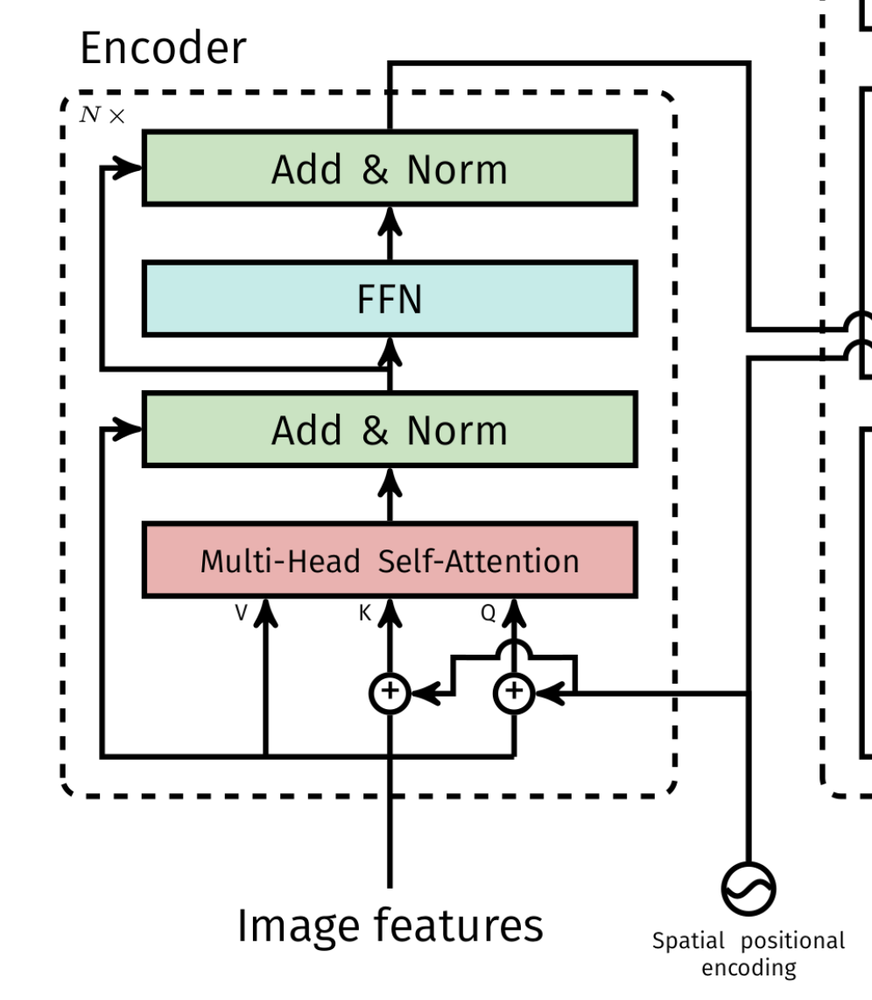
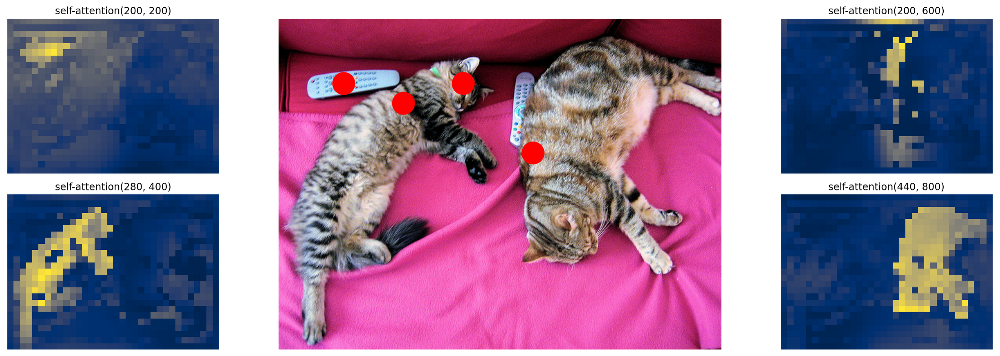

以下是将原文档中所有公式修改为 `$...$` 格式后的版本，内容保持不变：

# Transformer编码器结构是如何设计的

> 手撕DETR源码：从特征图到全局记忆，拆解自注意力如何替代卷积堆叠

如果你已经熟练运用Faster R-CNN、YOLO，对Anchor、NMS、Feature Pyramid如数家珍，那么面对Transformer在视觉领域的“降维打击”时，内心大概率会冒出一堆问号：**自注意力到底在看什么？位置编码是玄学吗？为什么DETR训练那么慢？**

今天，我们就以 **DETR**（Detection Transformer）的官方实现为例，把 **Encoder（编码器）** 的每一层螺丝拧下来，看看它究竟是怎么设计的。你不需要任何NLP基础，只需要带着CNN的思维惯性来“找不同”。

---

## 一、编码器的作用：给特征图“开天眼”

在DETR整体架构中，**编码器** （图1）接收的是CNN骨干网络（如ResNet-50）输出的**特征图**。它的任务不是检测，而是**全局关系建模**。

**图2：transformer编码器结构**

> 比喻：CNN骨干像一个本地侦探，只看得到每个小区域（感受野有限）。编码器则把所有这些区域的消息聚合起来，让每个像素“知道”整张图里其他像素在干什么。

换句话说，编码器输出是一组**具备全局上下文信息**的增强特征，供后续解码器生成目标查询（Object Queries）。**没有编码器，解码器只能看到局部碎片，根本无法区分重叠物体。**

---

## 二、编码器内部结构逐层拆解

DETR的编码器由6个相同的层堆叠而成（`num_encoder_layers=6`）。每一层包含三个核心操作：**多头自注意力** → **残差连接+层归一化** → **前馈网络(FFN)** → **残差连接+层归一化**。下面结合代码逐项拆解。

### 1. 输入特征图与空间位置编码：从图像到序列 + 坐标标签

#### 1.1 特征图如何变成序列？

CNN输出的特征图形状为 `(batch, C, H, W)`。Transformer吃的是**序列**，所以第一步是**拉直**：

```python
# 在 Transformer.forward 中
src = src.flatten(2).permute(2, 0, 1)   # [H*W, batch, C]
```

- `flatten(2)`：从第2维（C维）之后开始拉平，得到 `(batch, C, H*W)`
- `permute(2, 0, 1)`：把序列长度放到第0维，得到 `(H*W, batch, C)`

每个空间位置变成一个 `C` 维向量，序列长度 `HW` 通常几百到几千。

#### 1.2 为什么需要位置编码？如何生成？

自注意力是**排列不变**的（打乱序列顺序，注意力结果一样）。图像是有空间结构的，丢失位置信息等于自废武功。因此需要**位置编码**（Positional Encoding）。

DETR使用**可学习的空间位置编码**，形状与特征图相同 `(batch, C, H, W)`，同样拉直并加到输入上：

```python
pos_embed = pos_embed.flatten(2).permute(2, 0, 1)   # [H*W, batch, C]
# 后续每层都会将 pos_embed 传入
```

**特殊设计（重要）**：位置编码**不是只加在输入层**，而是**传入编码器的每一层**。从 `TransformerEncoder.forward` 可以看到：

```python
# TransformerEncoder.forward
for layer in self.layers:
    output = layer(output, src_mask=mask, 
                   src_key_padding_mask=src_key_padding_mask, pos=pos)
```

为什么要每层都加？因为深层特征经过变换后，原始位置信息会被“稀释”，重复注入位置编码能帮助模型维持空间对应关系。

#### 1.3 特征图与位置编码如何相加？

关键点：**特征图和位置编码是逐元素相加**，而不是拼接。两者形状完全相同 `(HW, batch, C)`，直接做加法：

```
encoder_input = src + pos_embed
```

但这个加法不是一次性在输入层完成的，而是发生在**编码器每一层的自注意力计算之前**。具体代码在 `TransformerEncoderLayer.forward_post` 中：

```python
def forward_post(self, src, src_mask=None, src_key_padding_mask=None, pos=None):
    # 关键函数：将 src 与 pos 相加
    q = k = self.with_pos_embed(src, pos)
    ...
```

而 `with_pos_embed` 的实现非常简单：

```python
def with_pos_embed(self, tensor, pos: Optional[Tensor]):
    return tensor if pos is None else tensor + pos
```

**为什么是相加而不是拼接？**

- 如果拼接，维度会翻倍（`C` → `2C`），增加参数量和计算量。
- 相加保持了维度不变，且符合Transformer的原始设计（原论文中位置编码直接加在词嵌入上）。
- 相加操作可以理解为：位置编码提供“偏置”，让注意力权重依赖于位置，同时保留内容信息。

**整个流程示意**：

```
特征图 src (HW, batch, C)  ──┐
                              ├── 逐元素相加 ──→ Q = K = src + pos
位置编码 pos (HW, batch, C) ──┘
```

注意：这里的加法只在计算 Q 和 K 时发生，V 仍然使用原始的 `src`（不加位置编码）。这个细节在下一节多头自注意力中会进一步解释。

---

### 2. 多头自注意力：全局交互的核心

#### 2.1 自注意力的公式与直觉

单头注意力：
$\text{Attention}(Q,K,V) = \text{softmax}\left(\frac{QK^T}{\sqrt{d_k}}\right)V$

- Q（Query）：我要查什么？
- K（Key）：你有什么属性？
- V（Value）：你实际带的信息是什么？

自注意力：Q、K、V来自同一输入序列。每个位置都去“询问”所有其他位置，根据相似度加权聚合V。

多头：将C维切分成 `nhead=8` 份，每份分别做注意力，然后拼接。这相当于让模型从多个子空间同时捕捉不同关系。

#### 2.2 带位置编码的实现

在 `TransformerEncoderLayer.forward_post` 中（默认后归一化模式）：

```python
def forward_post(self, src, src_mask=None, src_key_padding_mask=None, pos=None):
    # 将输入 src 与位置编码 pos 相加，作为 Q 和 K
    q = k = self.with_pos_embed(src, pos)
    # V 不加位置编码，直接使用原始 src
    src2 = self.self_attn(q, k, value=src, attn_mask=src_mask,
                          key_padding_mask=src_key_padding_mask)[0]
    # 后面接着残差和 LayerNorm...
```

**关键设计**：Q和K加位置编码，V不加。原因是：位置编码影响注意力权重的计算（两个位置的距离信息体现在相似度中），但被聚合的值本身不应该包含位置偏移，否则会把位置信息错误地叠加到特征内容上。

**比喻**：Q/K加位置编码就像在说“我在坐标(x1,y1)，询问你在哪里”；V不加就像在说“不管你在哪儿，你看到的内容就是内容本身”。

---

### 3. 前馈网络（FFN）：逐位置的非线性变换

每个编码器层在自注意力之后，都会接一个两层的MLP：

```python
# 接上面 forward_post 的后续代码
src2 = self.linear2(self.dropout(self.activation(self.linear1(src))))
src = src + self.dropout2(src2)
src = self.norm2(src)
```

维度变化：`d_model=512` → `dim_feedforward=2048` → `512`。激活函数默认ReLU。

**FFN的作用**：自注意力本质是线性变换（加权求和），缺乏非线性。FFN为每个位置**独立**地引入非线性，增强模型表达能力。可以理解为对注意力输出结果的“精加工”。注意：FFN是**位置独立**的（同一层不同位置共享参数），这大大减少了参数量。

---

### 4. 多层重叠：从局部到全局的抽象

编码器由6个结构相同但参数独立的层串联。每一层输出的特征图大小不变（`HW, batch, 512`）。在 `TransformerEncoder` 中通过简单的循环实现：

```python
output = src
for layer in self.layers:
    output = layer(output, ..., pos=pos)
```

**为什么需要多层？**
- 第一层：可能学习简单的颜色、纹理关系，感受野较小。
- 中间层：逐渐聚合更大的区域，捕获物体局部部件。
- 最后一层：每个位置的感受野覆盖全图，能区分同一物体的不同部分以及不同物体之间的边界。

实验表明6层是一个很好的平衡点。层数太少（≤3）则长距离依赖不够；太多（>12）则训练变慢且收益递减。

---

## 三、总结：每一部分都不可或缺，但收敛速度慢

| 组件 | 缺了会怎样 |
|------|-------------|
| **位置编码** | 模型分不清上下左右，把倒置的猫当成正常猫。 |
| **多头自注意力** | 退化成逐点全连接，丧失全局交互能力。 |
| **残差连接** | 深层网络梯度消失，6层都难训练。 |
| **FFN** | 只有线性变换，无法拟合复杂分布。 |
| **多层堆叠** | 单层感知野不足，大物体特征混叠。 |

**编码器的最大缺点：收敛速度慢。**

CNN通过卷积的**局部归纳偏置**（局部连接、权重共享、平移等变性）能够快速学到有效特征。而Transformer的全局自注意力没有这些先验知识，需要**更多数据**和**更长训练周期**才能学会合理的空间结构。

DETR在COCO上需要**500个epoch**才能饱和，而YOLOv3 300个epoch就够了。这也是后续Deformable DETR、Conditional DETR等改进的核心动机——通过引入稀疏注意力或条件空间先验来加速收敛。

---

## 四、代码运行：验证编码器的输入输出形状

### 4.1 打印编码器模型结构

下面是我们构建好的编码器模型，它是一个 `TransformerEncoder` 对象。需要注意的是，**PyTorch 对 nn.Module 的默认打印方式只会显示注册到模块中的子模块（submodules），而不会把 forward() 里的计算流程打印出来**。所以我们看到的是各个子层的定义，而非前向传播的逻辑。

```text
autodrv-self.encoder: TransformerEncoder(
  (layers): ModuleList(
    (0-5): 6 x TransformerEncoderLayer(
      (self_attn): MultiheadAttention(
        (out_proj): NonDynamicallyQuantizableLinear(in_features=256, out_features=256, bias=True)
      )
      (linear1): Linear(in_features=256, out_features=2048, bias=True)
      (dropout): Dropout(p=0.1, inplace=False)
      (linear2): Linear(in_features=2048, out_features=256, bias=True)
      (norm1): LayerNorm((256,), eps=1e-05, elementwise_affine=True)
      (norm2): LayerNorm((256,), eps=1e-05, elementwise_affine=True)
      (dropout1): Dropout(p=0.1, inplace=False)
      (dropout2): Dropout(p=0.1, inplace=False)
    )
  )
)
```

**结构解读**：
- `layers` 中包含 **6 个相同的 `TransformerEncoderLayer`**，对应前面提到的 `num_encoder_layers=6`。
- 每个 `TransformerEncoderLayer` 包含：
  - `self_attn`：多头自注意力模块，输出投影层 `out_proj` 将 256 维映射回 256 维。
  - `linear1` + `linear2`：FFN 的两个线性层，中间维度 2048。
  - `norm1`、`norm2`：两层 LayerNorm，分别用于自注意力之后和 FFN 之后。
  - `dropout1`、`dropout2`：两个 Dropout 层，p=0.1。
- 所有特征维度均为 **256**（`d_model=256`，注意实际 DETR 中常用 256 而非 512）。

### 4.2 运行模型：观察输入输出形状

实际运行编码器，打印输入和输出的形状：

```text
autodrv-TransformerEncoder: src shape: torch.Size([1050, 2, 256]), mask shape: None, pos shape: torch.Size([1050, 2, 256])
autodrv-TransformerEncoder: output shape after norm: torch.Size([1050, 2, 256])
```

**形状解读**：
- `1050` 是序列长度，即 `H*W`。这里 `1050 = 25 × 42`，说明特征图的空间尺寸是 `(25, 42)`。
- `2` 是 batch size（批次大小）。
- `256` 是每个 token 的特征维度（`d_model`）。

**关键观察**：
- **输入形状** `(1050, 2, 256)` 与 **输出形状** `(1050, 2, 256)` **完全相同**。
- 编码器没有改变序列长度，也没有改变特征维度。

### 4.3 编码器“起主要作用”的是什么？

既然输入和输出形状一模一样，那编码器到底做了什么？

**答案**：编码器改变的不是**形状**，而是**特征的内容**——也就是每个 token 的 256 维向量中承载的**语义信息**。

- **输入时**：每个 token 只包含 CNN 提取的**局部感受野信息**（比如一个 32×32 区域的纹理、边缘）。
- **经过 6 层自注意力后**：每个 token 融合了**全局上下文**——它“看到”了图像中所有其他位置的信息。因此，即使两个像素在空间上相距很远，它们也能相互影响。

**比喻**：
- 输入特征图 = 每个像素只知道自己周围一小块地方在发生什么（“井底之蛙”）。
- 输出特征图 = 每个像素都知道了整张图的全貌，包括远处物体的颜色、形状、甚至遮挡关系（“开了天眼”）。

这就是为什么编码器的输出被称为 **“记忆（memory）”**——它存储了整个图像的全局结构化信息，供解码器查询使用。

---

## 五、注意力热图解读：编码器最后一层学到了什么

下图是DETR官方给出的**编码器最后一层**的注意力热图。每个子图对应一个**参考点（红色圆点）**，颜色越亮表示该位置对参考点的注意力权重越高。

**图2：编码器最后一层注意力热图**

> **观察结论**：
> - 对于位于**物体内部**的参考点（比如马的身体、牛的躯干），注意力热图会**扩散到整个物体轮廓**，说明编码器学会了“物体内聚”——同一个物体的不同部位相互吸引。
> - 这种注意力模式**不需要任何边界框监督**，完全由自监督学习形成。

这也解释了为什么编码器能替代FPN和NMS：特征图中每个位置都聚合了同类物体的全局信息，后续解码器只需基于这些“高响应区域”直接预测边界框即可。

**比喻**：编码器就像一个“社交网络”——原本孤独的像素们通过自注意力互相加好友，最后形成一个个“物体社团”。解码器则直接问：“哪些社团代表一个完整的物体？”

---

## 写在最后

Transformer编码器并不是魔法。它用**全局自注意力**取代局部卷积，用**位置编码**保留空间结构，用**多层堆叠**逐步抽象关系。代价是放弃归纳偏置，导致收敛慢、数据饥渴。但一旦训好，它能捕捉到CNN难以企及的**长程依赖**——比如一根筷子两端的关系，或者被遮挡物体的完整轮廓。

希望这篇文章能帮你跨过“注意力恐惧”。下次看到ViT或DETR时，你能自信地说：“哦，不就是编码器里那点事儿吗？”