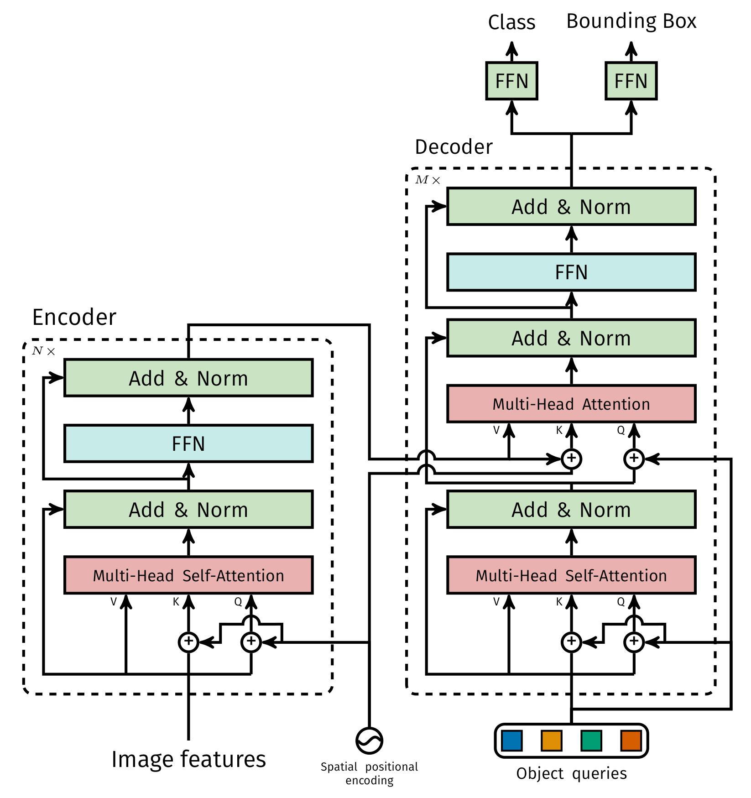
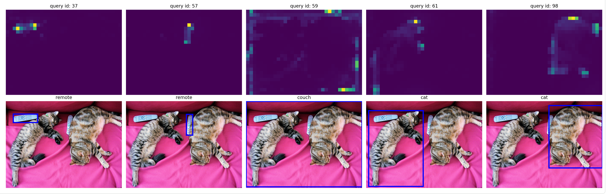

以下是修改后的公式部分，已将所有公式改为 `$...$` 格式，其余内容保持不变：

下面的公式在github上无法显示，请修改成 $...$这种格式的，内容维持不变。

# Transformer解码器Decoder结构是如何设计的

> 手撕DETR源码：从100个“空槽位”到精准检测框，拆解并行解码如何替代NMS

如果你已经搞懂了Faster R-CNN的RPN和ROI Align，也调过YOLO的Anchor Box，那么面对Transformer解码器时，脑子里大概率会闪过一个念头：**这玩意儿没有Anchor，没有NMS，甚至没有候选区域，到底是怎么把框“变”出来的？**

今天，我们就以**DETR**（Detection Transformer）的官方代码为解剖台，把**Decoder（解码器）**的每一层结构拆开揉碎。你会发现：它本质上是一组**可学习的“检测槽位”**，通过自注意力和交叉注意力，一步步从混沌中“凝练”出目标框。整个过程**并行、无先验、端到端**——这才是Transformer式检测的魅力所在。

---

## 一、解码器的作用：从“全图记忆”到“目标集合”


**图1 DETR中transformer结构图**

在DETR整体架构中（见图1），**解码器**接收两样东西：
- 编码器输出的**全图记忆（Memory）**：形状为 $(HW, batch, C)$，每个位置都包含了全局上下文信息。
- 一组**可学习的目标查询（Object Queries）**：通常100个，对应模型最多能检测的物体数量。

解码器的任务就是**将这100个空槽位“填满”**——每个槽位最终输出一个物体的类别和边界框。**不需要候选区域，不需要NMS，一次前向就能得到所有预测。**

> 比喻：编码器像一张**藏宝图**，标注了整片海域的暗流和礁石。解码器则像100个同时下水的**寻宝机器人**，每个机器人独立搜索，最后各自带回一个宝藏（或空手而归）。

---

## 二、解码器内部结构逐层拆解

DETR的解码器由6个相同的层堆叠而成（`num_decoder_layers=6`）。每一层的结构如图所示（包含四个核心操作）：**多头自注意力 → 残差+归一化 → 多头交叉注意力 → 残差+归一化 → FFN → 残差+归一化**。下面我们结合代码和DETR类的实现，逐项深入。

### 1. 可学习的目标查询（Object Queries）—— 检测槽位

这是解码器最关键的设计，也是很多初学者最困惑的地方。

#### 1.1 什么是目标查询？如何初始化？

在DETR类的构造函数中：

```python
# DETR.__init__
self.num_queries = num_queries          # 默认100
# 使用嵌入层来生成查询向量，查询数为num_queries，维度为hidden_dim。
self.query_embed = nn.Embedding(num_queries, hidden_dim)
```

`nn.Embedding(num_queries, hidden_dim)` 本质上是一个可学习的参数表，形状为 $(100, 256)$。每一行（256维向量）对应一个**检测槽位**。这些向量会作为**位置编码**（`query_pos`）输入到解码器的每一层。

#### 1.2 query_pos 的作用与传递路径

在 `Transformer.forward` 中，`query_embed` 被转换成与batch一致的形状，并传入解码器：

```python
# Transformer.forward
query_embed = query_embed.unsqueeze(1).repeat(1, bs, 1)  # [num_queries, batch, C]
tgt = torch.zeros_like(query_embed)                      # 初始化为全0
hs = self.decoder(tgt, memory, ..., query_pos=query_embed)
```

注意两个关键变量：
- **tgt**：解码器输入的内容特征，初始化为**全0**。
- **query_pos**：可学习的查询位置编码，与tgt**相加**后参与自注意力和交叉注意力。

#### 1.3 为什么tgt初始化为0，query_pos却初始化为随机参数？

**答案**：初始时刻，解码器“不知道要查什么”，内容为空是合理的。而`query_pos`作为**可学习的槽位标识**，为每个槽位提供唯一的“身份编码”。在训练过程中，模型会自主学会让不同槽位关注图像中的不同区域（比如1号槽专门盯左上的小物体，2号槽盯中间的大物体）。这相当于**让模型自己学会分工**。

> 比喻：`tgt` 是每个机器人的“当前记忆”，一开始是空白；`query_pos` 是机器人的**序列号**，从一开始就刻在芯片上，告诉它“你是第3号，你负责搜索中间区域”。

---

### 2. 多头自注意力：让槽位“互相商量”，避免重复检测

在解码器每一层的 `forward_post`（后归一化模式）中，首先执行自注意力：

```python
# TransformerDecoderLayer.forward_post
q = k = self.with_pos_embed(tgt, query_pos)      # tgt + query_pos
tgt2 = self.self_attn(q, k, value=tgt, ...)[0]
tgt = tgt + self.dropout1(tgt2)
tgt = self.norm1(tgt)
```

**关键点**：Q和K都加上了`query_pos`，V不加（与编码器逻辑一致）。自注意力的作用范围是**100个槽位之间**。

- 如果两个槽位都聚焦到同一个物体，自注意力会让它们互相抑制——一个槽位的高响应会通过注意力权重“告诉”另一个槽位：“这个物体我已经预定了，你去别处看看。”
- 这种**槽位间的通信**天然替代了传统检测中的**NMS**（非极大值抑制）。实验证明，如果没有自注意力，DETR会产生大量重复框。

---

### 3. 多头交叉注意力：查询图像记忆，提取特征

自注意力之后，解码器层执行**交叉注意力**，这是连接解码器与编码器输出的桥梁：

```python
# TransformerDecoderLayer.forward_post（续）
tgt2 = self.multihead_attn(
    query=self.with_pos_embed(tgt, query_pos),     # Q = tgt + query_pos
    key=self.with_pos_embed(memory, pos),          # K = memory + 空间位置编码
    value=memory,                                  # V = memory (不加位置编码)
    attn_mask=memory_mask,
    key_padding_mask=memory_key_padding_mask
)[0]
tgt = tgt + self.dropout2(tgt2)
tgt = self.norm2(tgt)
```

#### 3.1 交叉注意力的输入详解

- **Query**：来自上一层的`tgt`（经过自注意力更新后的内容）加上`query_pos`（槽位身份）。这表示每个槽位带着自己的“记忆”和“编号”去询问记忆。
- **Key**：编码器的输出`memory`（即全图特征）加上**空间位置编码**`pos`。空间位置编码和编码器使用的是同一个（由骨干网络输出经过正弦/可学习编码得到），它的作用是告诉解码器“图像中每个点位于哪个坐标”。
- **Value**：原始`memory`，不加位置编码。这和自注意力中的设计一致——位置信息只用于计算注意力权重，不污染值内容。

#### 3.2 交叉注意力学到了什么？

每个槽位的query会在`memory`上产生一个注意力热图（见图2），高亮区域就是该槽位认为是目标的地方。由于`query_pos`是可学习的，不同槽位会自动**分化**——有的关注小物体，有的关注大物体，有的关注左上角，有的关注中心。这种**无监督的槽位分工**是DETR最优雅的特性之一。

---

### 4. FFN前馈网络：精加工槽位特征

交叉注意力之后，每个槽位独立经过一个两层MLP（FFN）：

```python
# TransformerDecoderLayer.forward_post（续）
tgt2 = self.linear2(self.dropout(self.activation(self.linear1(tgt))))
tgt = tgt + self.dropout3(tgt2)
tgt = self.norm3(tgt)
```

维度变化：`hidden_dim=256` → `dim_feedforward=2048` → `256`，激活函数默认ReLU。

FFN的作用和编码器中一样：为每个槽位的向量引入**非线性变换**，提升模型对边界框坐标和类别分布的拟合能力。没有FFN，解码器只是一个线性变换层，表达能力大打折扣。

---

### 5. 多层重叠：从“全0”到“精准预测”

解码器将6个相同的层串联。第一层输入`tgt`为全0，意味着初始时槽位没有任何内容。那么第一层的交叉注意力就**占据主导地位**——它直接从编码器的`memory`中拉取信息，填充到`tgt`中。之后每一层在上一层的`tgt`基础上进一步精炼。

在DETR的`forward`中，我们得到所有层的输出`hs`，形状为 $(6, batch, 100, 256)$。然后只用最后一层的输出去预测类别和框：

```python
# DETR.forward
hs = self.transformer(...)[0]          # hs shape: [num_decoder_layers, batch, num_queries, hidden_dim]
outputs_class = self.class_embed(hs)   # 每层都做预测
outputs_coord = self.bbox_embed(hs).sigmoid()
out = {'pred_logits': outputs_class[-1], 'pred_boxes': outputs_coord[-1]}  # 只用最后一层
```

如果开启`aux_loss`，则每一层的预测都会参与损失计算（称为**辅助损失**），这有助于缓解梯度消失并加速收敛。

---

## 三、总结：并行解码与不可或缺的组件

| 组件 | 作用 | 不可或缺的原因 |
|------|------|----------------|
| **可学习的查询（query_pos）** | 为每个槽位提供唯一身份，让模型学会自动分工 | 没有它，100个槽位会完全一致，都聚焦到同一个物体 |
| **初始全0 tgt** | 让第一层交叉注意力从记忆直接获取内容 | 非0初始化会引入先验偏差，破坏端到端学习 |
| **多头自注意力** | 槽位之间互相通信，抑制重复预测 | 没有它，模型会输出大量重复框，NMS也无法完全解决 |
| **多头交叉注意力** | 从编码器记忆中提取物体特征 | 没有它，解码器与图像内容完全割裂 |
| **FFN** | 非线性精加工，拟合坐标与类别分布 | 没有它，模型退化为线性，精度大幅下降 |
| **多层堆叠** | 逐步精炼槽位特征，从粗糙到精细 | 单层感知能力有限，难以处理复杂场景 |

**最关键的不同：并行解码**

标准的Transformer解码器（如机器翻译）是**自回归**的——逐个生成单词，上一个输出作为下一个输入。但DETR的解码器是**并行的**：所有100个槽位同时迭代更新，一次前向就能输出全部预测。这得益于**检测任务没有序列依赖**——物体之间没有固定的顺序。并行解码让DETR的推理速度远超传统的RNN式解码器。

---

## 四、代码运行：验证解码器的输入输出与中间状态

下面通过实际运行打印的信息，验证解码器的设计细节。需要注意的是，**PyTorch 对 nn.Module 的默认打印方式只会显示注册到模块中的子模块（submodules），而不会把 forward() 里的计算流程打印出来**。所以我们看到的是各个子层的定义，而非前向传播的逻辑。

### 4.1 模型结构

```text
autodrv-self.decoder: TransformerDecoder(
  (layers): ModuleList(
    (0-5): 6 x TransformerDecoderLayer(
      (self_attn): MultiheadAttention(
        (out_proj): NonDynamicallyQuantizableLinear(in_features=256, out_features=256, bias=True)
      )
      (multihead_attn): MultiheadAttention(
        (out_proj): NonDynamicallyQuantizableLinear(in_features=256, out_features=256, bias=True)
      )
      (linear1): Linear(in_features=256, out_features=2048, bias=True)
      (dropout): Dropout(p=0.1, inplace=False)
      (linear2): Linear(in_features=2048, out_features=256, bias=True)
      (norm1): LayerNorm((256,), eps=1e-05, elementwise_affine=True)
      (norm2): LayerNorm((256,), eps=1e-05, elementwise_affine=True)
      (norm3): LayerNorm((256,), eps=1e-05, elementwise_affine=True)
      (dropout1): Dropout(p=0.1, inplace=False)
      (dropout2): Dropout(p=0.1, inplace=False)
      (dropout3): Dropout(p=0.1, inplace=False)
    )
  )
  (norm): LayerNorm((256,), eps=1e-05, elementwise_affine=True)
)
```

可见解码器包含6层，每层有自注意力、交叉注意力、FFN，以及对应的LayerNorm和Dropout。特征维度256，FFN中间层2048。

### 4.2 前向传播形状

```text
autodrv-TransformerDecoder: tgt shape: torch.Size([100, 2, 256]), memory shape: torch.Size([1050, 2, 256]), tgt_mask shape: None, memory_mask shape: None, tgt_key_padding_mask shape: None, memory_key_padding_mask shape: torch.Size([2, 1050]), pos shape: torch.Size([1050, 2, 256]), query_pos shape: torch.Size([100, 2, 256])
```

- `tgt`：初始全0，形状 $(100, 2, 256)$ → 100个查询槽位，batch=2，维度256
- `memory`：编码器输出 $(1050, 2, 256)$ → 序列长度1050（H×W），batch=2
- `query_pos`：可学习的位置编码 $(100, 2, 256)$
- `pos`：空间位置编码 $(1050, 2, 256)$
- `memory_key_padding_mask`：标记padding位置 $(2, 1050)$

### 4.3 输出形状

```text
autodrv-TransformerDecoder: output shape after norm: torch.Size([100, 2, 256])
```

输出形状与输入`tgt`完全相同，但内容已从全0向量变为携带物体信息的特征向量。

### 4.4 中间层输出（辅助损失）

```text
autodrv-TransformerDecoder: intermediate output shape: [torch.Size([100, 2, 256]), torch.Size([100, 2, 256]), torch.Size([100, 2, 256]), torch.Size([100, 2, 256]), torch.Size([100, 2, 256]), torch.Size([100, 2, 256])]
autodrv-TransformerDecoder: returning intermediate outputs,torch.stack(intermediate).shape: torch.Size([6, 100, 2, 256])
```

由于 `return_intermediate_dec=True`，解码器返回每一层的输出，形状均为 $(100, 2, 256)$，堆叠后为 $(6, 100, 2, 256)$。这些中间层可用于辅助损失，加速收敛。

---

## 五、注意力热图解读：解码器最后一层学到了什么



**图2 DETR解码器最后一层交叉注意力热图**

上图是DETR官方给出的**解码器最后一层**交叉注意力热图。每张子图对应一个目标查询（槽位），红色圆点表示该槽位的参考点（可理解为query的空间位置），颜色越亮表示该区域对当前槽位的注意力权重越高。

**观察结论**：
- 不同槽位的注意力热图呈现出**明显的分工**：不同的查询槽位可以聚焦于不同目标。即使同一个物体（比如一张图中有两个猫），不同槽位也会自动选择不同个体，极少出现两个槽位同时瞄准同一匹马。
- 在关注某一个目标时，常常会聚焦于目标边缘的某些特征，这是因为训练时加入的边界框的权重，聚焦边缘更容易学会如何表达尺寸大小。

> 比喻：100个寻宝机器人经过6轮迭代沟通后，各自锁定了一个宝藏的精确坐标。有些机器人放弃了（输出“无物体”），有些则自信地举起手：“我找到了，就在红点附近！”

---

## 写在最后

Transformer解码器并没有想象中那么神秘。它本质上是一个**可学习的、并行的集合预测器**。丢掉Anchor、丢掉RPN、丢掉NMS，换来的是简洁的架构和端到端的优雅。当然，代价是训练收敛慢、需要更多数据。但当你看到注意力热图中那一个个自动分化的“检测槽位”时，你会觉得——这一切都是值得的。

希望这篇文章能帮你解开对DETR解码器的疑惑。下一次当你看到`num_queries=100`，你能会心一笑：“哦，就是那100个‘槽位’嘛。”