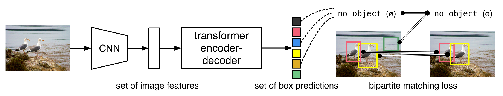
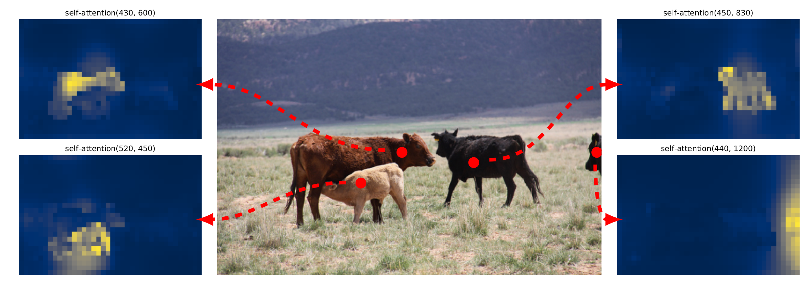
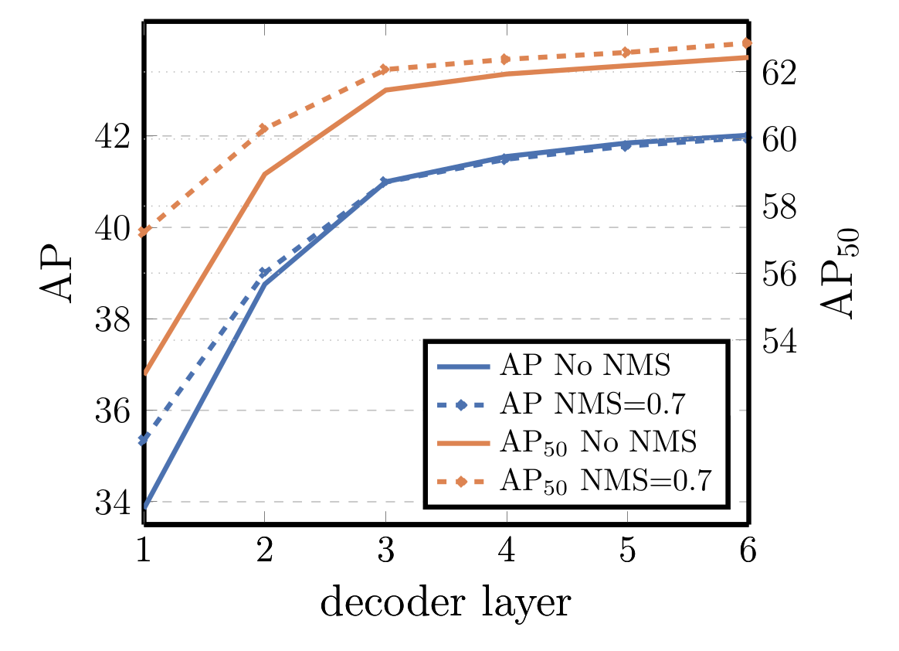
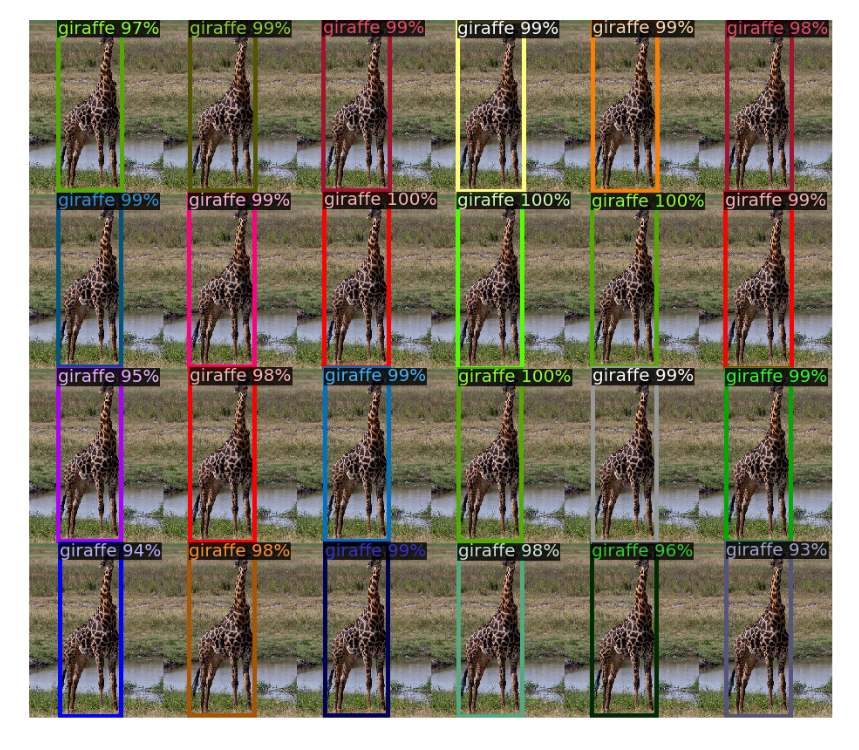
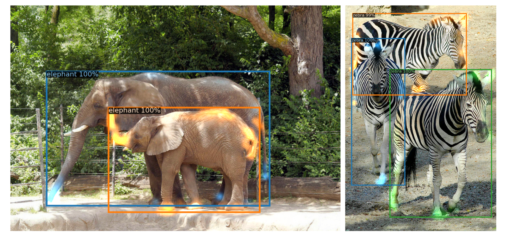
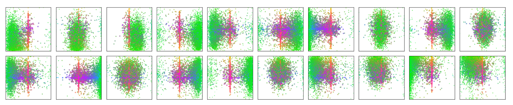
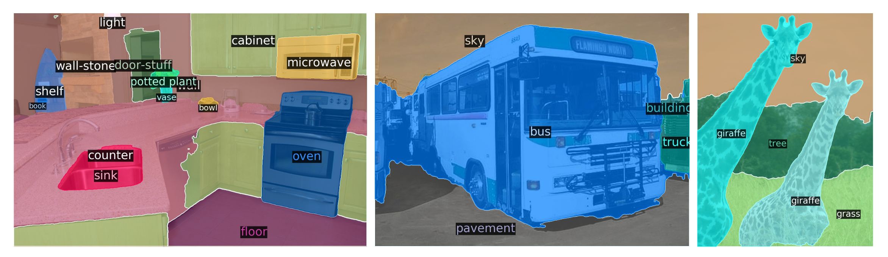
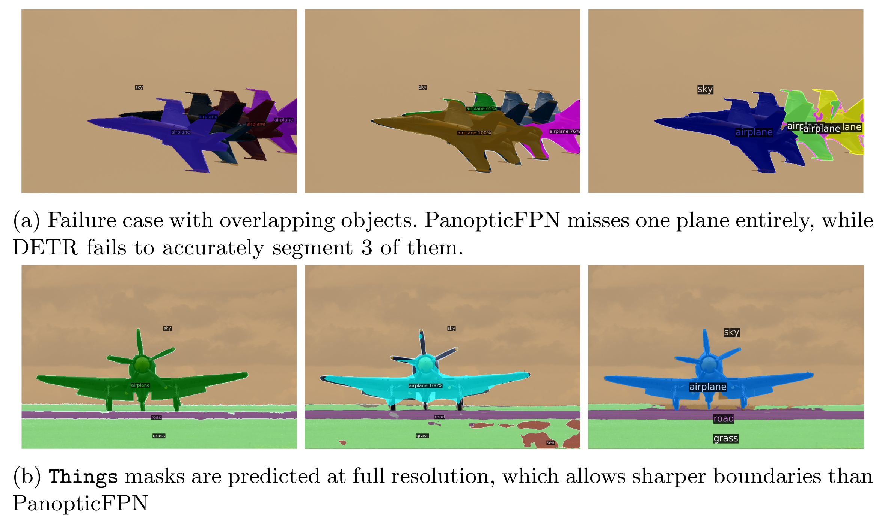
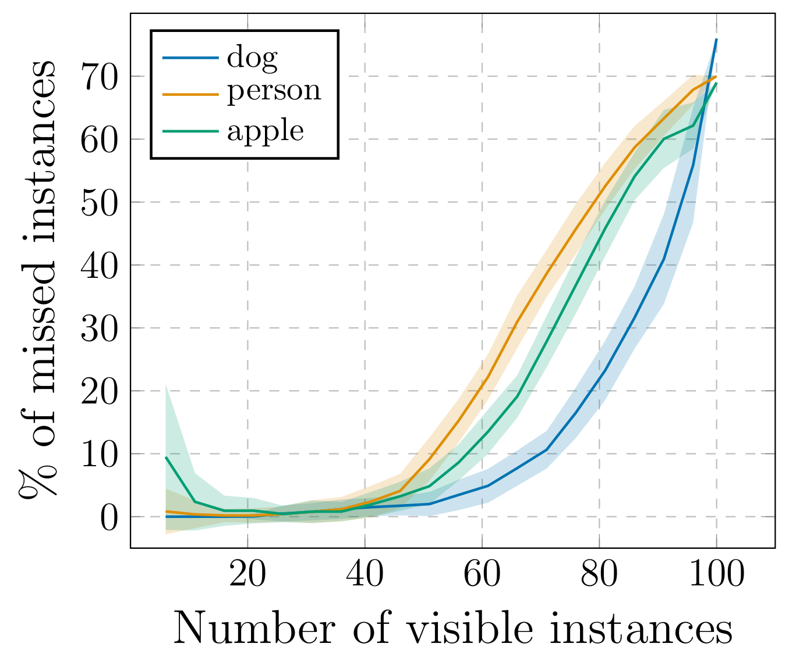

以下是修改后的内容，参考文献已按标准格式换行：

# 基于Transformer的端到端目标检测

作者：Nicolas Carion\*, Francisco Massa\*, Gabriel Synnaeve, Nicolas Usunier, Alexander Kirillov, Sergey Zagoruyko

单位：Facebook AI

**摘要**：我们提出了一种将目标检测视为直接集合预测问题的新方法。我们的方法简化了检测流程，有效地去除了许多手工设计的组件，例如非极大值抑制过程或锚点生成，这些组件显式地编码了我们对任务的先验知识。这个新框架名为DEtection TRansformer（简称DETR），其主要组成部分是一个基于集合的全局损失函数（通过二分匹配强制产生唯一的预测）和一个Transformer编码器-解码器架构。给定一小组固定的学习型目标查询（object queries），DETR会推理目标之间的关系以及全局图像上下文，直接并行输出最终的预测集合。这个新模型概念简单，并且不像许多其他现代检测器那样需要专门的库。在具有挑战性的COCO目标检测数据集上，DETR在准确性和运行时间性能上与成熟且高度优化的Faster R-CNN基线相当。此外，DETR可以轻松地推广到以统一的方式生成全景分割。我们证明它显著优于有竞争力的基线。训练代码和预训练模型可在 https://github.com/facebookresearch/detr 获取。

## 1 引言

目标检测的目标是为每个感兴趣的目标预测一组边界框和类别标签。现代检测器通过在一大组提议框[37,5]、锚点[23]或窗口中心[53,46]上定义替代的回归和分类问题，以间接的方式处理这个集合预测任务。它们的性能受到以下因素的显著影响：用于合并近似重复预测的后处理步骤、锚点集的设计以及将目标框分配给锚点的启发式规则[52]。为了简化这些流程，我们提出了一种直接的集合预测方法来绕过替代任务。这种端到端的理念已经在机器翻译或语音识别等复杂结构化预测任务中带来了显著进展，但在目标检测中尚未实现：先前的尝试[43,16,4,39]要么添加了其他形式的先验知识，要么未能在具有挑战性的基准测试中证明与强基线具有竞争力。本文旨在弥合这一差距。


**图1：DETR通过结合通用CNN和Transformer架构，直接（并行地）预测最终的检测集合。在训练期间，二分匹配将预测唯一地分配给真实标注框。没有匹配的预测应产生“无目标”（$\varnothing$）类别预测。**

我们将目标检测视为一个直接的集合预测问题，从而简化了训练流程。我们采用了基于Transformer的编码器-解码器架构[47]，这是一种流行的序列预测架构。Transformer的自注意力机制显式地建模了序列中所有元素对之间的相互作用，这使得该架构特别适合集合预测的特定约束，例如消除重复预测。

我们的DEtection TRansformer（DETR，见图1）一次性预测所有目标，并使用集合损失函数进行端到端训练，该函数在预测目标和真实目标之间执行二分匹配。DETR通过丢弃多个编码先验知识的手工设计组件（如空间锚点或非极大值抑制）来简化检测流程。与大多数现有的检测方法不同，DETR不需要任何定制的层，因此可以在任何包含标准CNN和Transformer类的框架中轻松复现。

与大多数先前的直接集合预测工作相比，DETR的主要特点是二分匹配损失与（非自回归）并行解码的Transformer的结合[29,12,10,8]。相比之下，先前的工作专注于使用RNN进行自回归解码[43,41,30,36,42]。我们的匹配损失函数将预测唯一地分配给真实目标，并且对于预测的排列是不变的，因此我们可以并行地发出预测。

我们在最流行的目标检测数据集之一COCO[24]上，与非常有竞争力的Faster R-CNN基线[37]进行了评估。Faster R-CNN经历了多次设计迭代，自原始论文发表以来其性能已大幅提升。我们的实验表明，我们的新模型取得了可比的性能。更准确地说，DETR在大目标上表现出明显更好的性能，这一结果可能是通过Transformer的非局部计算实现的。然而，它在小目标上的表现较差。我们希望未来的工作能够像FPN[22]对Faster R-CNN所做的那样，改进这一方面。

DETR的训练设置与标准目标检测器在多个方面有所不同。新模型需要超长的训练计划，并且受益于Transformer中的辅助解码损失。我们深入探讨了哪些组成部分对展示的性能至关重要。

DETR的设计理念易于扩展到更复杂的任务。在我们的实验中，我们展示了一个在预训练DETR之上训练的简单分割头，在最近流行的具有挑战性的像素级识别任务——全景分割[19]上，优于有竞争力的基线。

## 2 相关工作

我们的工作建立在多个领域的先前工作之上：用于集合预测的二分匹配损失、基于Transformer的编码器-解码器架构、并行解码以及目标检测方法。

### 2.1 集合预测

目前没有规范的深度学习模型可以直接预测集合。基本的集合预测任务是多标签分类（例如，在计算机视觉背景下可参考[40,33]），其基线方法“一对多”不适用于检测等问题，因为这类问题中元素之间存在底层结构（即，近乎相同的框）。这些任务的第一个难点是避免近似重复。大多数当前的检测器使用后处理（如非极大值抑制）来解决这个问题，但直接的集合预测是无后处理的。它们需要全局推理方案，对预测的所有元素之间的交互进行建模以避免冗余。对于固定大小的集合预测，密集全连接网络[9]是足够的但计算成本高。一种通用方法是使用自回归序列模型，如循环神经网络[48]。在所有情况下，损失函数都应对预测的排列保持不变。通常的解决方案是基于匈牙利算法[20]设计一个损失函数，以在真实标注和预测之间找到二分匹配。这强制了排列不变性，并确保每个目标元素都有唯一匹配。我们遵循二分匹配损失的方法。然而，与大多数先前工作不同的是，我们放弃了自回归模型，转而使用并行解码的Transformer，如下所述。

### 2.2 Transformer与并行解码

Transformer由Vaswani等人[47]引入，作为机器翻译的一种新的基于注意力的构建模块。注意力机制[2]是一种从整个输入序列中聚合信息的神经网络层。Transformer引入了自注意力层，类似于非局部神经网络[49]，它会遍历序列中的每个元素，并通过从整个序列聚合信息来更新它。基于注意力的模型的主要优势之一是其全局计算和完美记忆，这使其比RNN更适合处理长序列。Transformer现在正在自然语言处理、语音处理和计算机视觉[8,27,45,34,31]的许多问题中取代RNN。

Transformer最初用于自回归模型，遵循早期的序列到序列模型[44]，逐个生成输出标记。然而，其高昂的推理成本（与输出长度成正比，且难以批处理）促使了并行序列生成的发展，应用领域包括音频[29]、机器翻译[12,10]、词表示学习[8]以及最近的语音识别[6]。我们也将Transformer和并行解码结合起来，以获得计算成本和执行集合预测所需的全局计算能力之间的良好权衡。

### 2.3 目标检测

大多数现代目标检测方法都是相对于一些初始猜测进行预测。两阶段检测器[37,5]相对于提议框预测边界框，而单阶段方法则相对于锚点[23]或可能的目标中心网格[53,46]进行预测。最近的工作[52]表明，这些系统的最终性能在很大程度上取决于这些初始猜测的确切设置方式。在我们的模型中，我们能够去除这个手工设计的过程，通过直接预测检测集合，并进行相对于输入图像的绝对边界框预测（而非锚点），从而简化检测流程。

**基于集合的损失**。一些目标检测器[9,25,35]使用了二分匹配损失。然而，在这些早期的深度学习模型中，不同预测之间的关系仅通过卷积层或全连接层建模，手工设计的NMS后处理可以提高其性能。较新的检测器[37,23,53]使用真实标注和预测之间的非唯一分配规则以及NMS。

可学习的NMS方法[16,4]和关系网络[17]使用注意力显式地建模不同预测之间的关系。使用直接的集合损失，它们不需要任何后处理步骤。然而，这些方法使用了额外的、手工设计的上下文特征（如提议框坐标）来高效地建模检测之间的关系，而我们寻求的是减少模型中编码的先验知识。

**循环检测器**。与我们方法最接近的是用于目标检测[43]和实例分割[41,30,36,42]的端到端集合预测。与我们类似，它们使用基于CNN激活的编码器-解码器架构和二分匹配损失，直接生成一组边界框。然而，这些方法仅在小型数据集上进行了评估，并未与当代基线进行比较。特别是，它们基于自回归模型（更准确地说是RNN），因此没有利用带有并行解码的最先进的Transformer。

## 3 DETR模型

检测中直接集合预测的两个关键要素是：(1) 一个集合预测损失，强制预测框与真实标注框之间进行唯一匹配；(2) 一个架构，（在单次前向传播中）预测一组目标并建模它们之间的关系。我们在图2中详细描述了我们的架构。

### 3.1 目标检测集合预测损失

DETR通过解码器的一次前向传播，推断出一个固定大小的集合，包含 $N$ 个预测，其中 $N$ 被设置为显著大于图像中典型目标的数量。训练的主要困难之一是根据真实标注对预测的目标（类别、位置、大小）进行评分。我们的损失函数首先在预测目标和真实目标之间产生一个最优的二分匹配，然后优化特定于目标的（边界框）损失。

我们用 $y$ 表示真实目标集合，用 $\hat{y} = \{\hat{y}_i\}_{i = 1}^N$ 表示 $N$ 个预测的集合。假设 $N$ 大于图像中目标的数量，我们也将 $y$ 视为一个大小为 $N$ 的集合，并用 $\varnothing$（无目标）填充。为了在这两个集合之间找到一个二分匹配，我们搜索一个 $N$ 个元素的排列 $\sigma \in \mathfrak{S}_N$，使得成本最低：

$$\hat{\sigma} = \underset {\sigma \in \mathfrak{S}_N}{\arg \min}\sum_i^N\mathcal{L}_{\mathrm{match}}(y_i,\hat{y}_{\sigma (i)}), \quad (1)$$

其中 $\mathcal{L}_{\mathrm{match}}(y_i,\hat{y}_{\sigma (i)})$ 是真实目标 $y_{i}$ 与索引为 $\sigma (i)$ 的预测之间的配对匹配成本。这个最优分配可以使用匈牙利算法高效计算，遵循先前的工作（例如[43]）。

匹配成本同时考虑了类别预测以及预测框与真实框的相似度。真实目标集合中的每个元素 $i$ 可以看作 $y_{i} = (c_{i},b_{i})$，其中 $c_{i}$ 是目标类别标签（可能是 $\varnothing$），$b_{i}\in [0,1]^{4}$ 是一个向量，定义了真实框的中心坐标以及相对于图像尺寸的高度和宽度。对于索引为 $\sigma (i)$ 的预测，我们定义其类别 $c_{i}$ 的概率为 $\hat{p}_{\sigma (i)}(c_{i})$，预测的边界框为 $\hat{b}_{\sigma (i)}$。根据这些符号，我们将 $\mathcal{L}_{\mathrm{match}}(y_i,\hat{y}_{\sigma (i)})$ 定义为 $- \mathbb{1}_{\{c_i\neq \emptyset \}}\hat{p}_{\sigma (i)}(c_i) + \mathbb{1}_{\{c_i\neq \emptyset \}}\mathcal{L}_{\mathrm{box}}(b_i,\hat{b}_{\sigma (i)})$。

这个寻找匹配的过程，扮演了与现有检测器中使用启发式分配规则将提议框[37]或锚点[22]匹配到真实目标相同的角色。主要区别在于，我们需要为一对一的匹配找到直接的集合预测，以避免重复。

第二步是计算损失函数，即对上一步中匹配的所有对计算匈牙利损失。我们定义的损失类似于常见目标检测器的损失，即类别预测的负对数似然和后面定义的边界框损失的线性组合：

$$\mathcal{L}_{\mathrm{Hungarian}}(y,\hat{y}) = \sum_{i = 1}^{N}\left[-\log \hat{p}_{\hat{\sigma}(i)}(c_i) + \mathbb{1}_{\{c_i\neq \emptyset \}}\mathcal{L}_{\mathrm{box}}(b_i,\hat{b}_{\hat{\sigma}(i)})\right], \quad (2)$$

其中 $\hat{\sigma}$ 是在第一步（1）中计算出的最优分配。在实践中，当 $c_{i} = \varnothing$ 时，我们将对数概率项的权重降低10倍，以解决类别不平衡问题。这类似于Faster R-CNN训练过程中通过子采样[37]来平衡正/负提议框。请注意，一个目标与 $\varnothing$ 之间的匹配成本不依赖于预测，这意味着在这种情况下成本是一个常数。在匹配成本中，我们使用概率 $\hat{p}_{\sigma (i)}(c_i)$ 而不是对数概率。这使得类别预测项与 $\mathcal{L}_{\mathrm{box}}(\cdot ,\cdot)$（如下所述）具有可比性，并且我们观察到更好的经验性能。

**边界框损失**。匹配成本和匈牙利损失的第二部分是 $\mathcal{L}_{\mathrm{box}}(\cdot)$，它对边界框进行评分。与许多检测器相对于某些初始猜测进行 $\Delta$ 预测不同，我们直接进行边界框预测。虽然这种方法简化了实现，但它带来了损失相对缩放的问题。最常用的 $\ell_1$ 损失对于小框和大框会有不同的尺度，即使它们的相对误差相似。为了缓解这个问题，我们使用了 $\ell_1$ 损失和尺度不变的广义IoU损失[38] $\mathcal{L}_{\mathrm{iou}}(\cdot ,\cdot)$ 的线性组合。总的来说，我们的边界框损失 $\mathcal{L}_{\mathrm{box}}(b_i,\hat{b}_{\sigma (i)})$ 定义为 $\lambda_{\mathrm{iou}}\mathcal{L}_{\mathrm{iou}}(b_i,\hat{b}_{\sigma (i)}) + \lambda_{\mathrm{L1}}||b_i - \hat{b}_{\sigma (i)}||_1$，其中 $\lambda_{\mathrm{iou}},\lambda_{\mathrm{L1}}\in \mathbb{R}$ 是超参数。这两个损失通过批次内的目标数量进行归一化。

### 3.2 DETR架构


**图2：DETR使用传统的CNN骨干网络来学习输入图像的2D表示。模型将其展平，并在将其传递给Transformer编码器之前，用位置编码进行补充。然后，一个Transformer解码器将一小部分固定的学习型位置嵌入（我们称之为目标查询）作为输入，此外还会关注编码器的输出。我们将解码器的每个输出嵌入传递给一个共享的前馈网络（FFN），该网络预测一个检测（类别和边界框）或“无目标”类别。**

整体的DETR架构出奇地简单，如图2所示。它包含三个主要组件，我们在下面描述：一个用于提取紧凑特征表示的CNN骨干网络，一个编码器-解码器Transformer，以及一个进行最终检测预测的简单前馈网络（FFN）。

与许多现代检测器不同，DETR可以在任何提供通用CNN骨干网络和Transformer架构实现的深度学习框架中实现，只需几百行代码。DETR的推理代码可以在PyTorch [32]中用不到50行代码实现。我们希望我们方法的简洁性能够吸引新的研究人员进入检测领域。

**骨干网络**。从初始图像 $x_{\mathrm{img}}\in \mathbb{R}^{3\times H_0\times W_0}$（3个颜色通道）开始，一个传统的CNN骨干网络生成一个较低分辨率的激活图 $f\in \mathbb{R}^{C\times H\times W}$。我们使用的典型值是 $C = 2048$ 和 $H,W = \frac{H_0}{32},\frac{W_0}{32}$。

**Transformer编码器**。首先，一个1x1卷积将高层激活图 $f$ 的通道维度从 $C$ 减小到一个更小的维度 $d$，生成一个新的特征图 $z_0\in \mathbb{R}^{d\times H\times W}$。编码器期望一个序列作为输入，因此我们将 $z_0$ 的空间维度展平为一维，得到一个 $d\times HW$ 的特征图。每个编码器层具有标准架构，由一个多头自注意力模块和一个前馈网络（FFN）组成。由于Transformer架构是排列不变的，我们为其补充了固定的位置编码[31,3]，并将其添加到每个注意力层的输入中。我们将架构的详细定义推迟到补充材料中，它遵循[47]中描述的架构。

**Transformer解码器**。解码器遵循Transformer的标准架构，使用多头自注意力和编码器-解码器注意力机制，将 $N$ 个大小为 $d$ 的嵌入进行转换。与原始Transformer的区别在于，我们的模型在每个解码器层并行地解码 $N$ 个目标，而Vaswani等人[47]使用的是逐个预测输出序列的自回归模型。我们请不熟悉概念的读者参考补充材料。由于解码器也是排列不变的，$N$ 个输入嵌入必须不同才能产生不同的结果。这些输入嵌入是学习到的位置编码，我们称之为目标查询，与编码器类似，我们将它们添加到每个注意力层的输入中。$N$ 个目标查询由解码器转换为输出嵌入。然后，它们被一个前馈网络（在下一小节中描述）独立地解码为边界框坐标和类别标签，产生 $N$ 个最终预测。通过对这些嵌入使用自注意力和编码器-解码器注意力，该模型利用它们之间的成对关系全局地推理所有目标，同时能够使用整个图像作为上下文。

**预测前馈网络（FFNs）**。最终的预测由一个3层感知机（使用ReLU激活函数，隐藏维度为 $d$）和一个线性投影层计算得出。FFN预测相对于输入图像的归一化中心坐标、高度和宽度，线性层使用softmax函数预测类别标签。由于我们预测的是一个固定大小的 $N$ 个边界框的集合，其中 $N$ 通常远大于图像中实际感兴趣的目标数量，因此使用一个特殊的类别标签 $\varnothing$ 来表示某个槽位内未检测到目标。这个类别在标准目标检测方法中扮演着类似于“背景”类的角色。

**辅助解码损失**。我们发现，在训练期间使用解码器中的辅助损失[1]是有帮助的，特别是为了帮助模型输出正确数量的目标。

## 4 实验

我们展示了在COCO数据集上，DETR与Faster R-CNN相比取得了有竞争力的定量评估结果。然后，我们对架构和损失进行了详细的消融研究，并提供了一些见解和定性结果。最后，为了展示DETR是一个通用且可扩展的模型，我们展示了在全景分割上的结果，仅在一个固定的DETR模型上训练了一个小的扩展。我们提供了代码和预训练模型，以在https://github.com/facebookresearch/detr 复现我们的实验。

**数据集**。我们在COCO 2017检测和全景分割数据集[24,18]上进行实验，该数据集包含118k张训练图像和5k张验证图像。每张图像都标注了边界框和全景分割。训练集中每张图像平均有7个实例，单张图像中最多有63个实例，在同一张图像中，目标尺寸从小覆盖到大。除非另有说明，我们报告的AP是边界框AP，即在多个阈值上的积分指标。为了与Faster R-CNN进行比较，我们报告最后一个训练周期的验证AP；对于消融研究，我们报告最后10个周期的验证结果的中位数。

**技术细节**。我们使用AdamW [26]训练DETR，设置初始Transformer的学习率为 $10^{- 4}$，骨干网络的学习率为 $10^{- 5}$，权重衰减为 $10^{- 4}$。所有Transformer权重使用Xavier初始化[11]进行初始化，骨干网络使用来自TORCHVISION的ImageNet预训练ResNet模型[15]，并冻结批归一化层。我们报告了两种不同骨干网络的结果：ResNet-50和ResNet-101。相应的模型分别称为DETR和DETR-R101。遵循[21]，我们还通过在骨干网络的最后阶段添加空洞卷积并移除该阶段第一个卷积的步长来增加特征分辨率。相应的模型分别称为DETR-DC5和DETR-DC5-R101（膨胀的C5阶段）。这种修改将分辨率提高了两倍，从而提高了小目标的性能，但代价是编码器自注意力的计算成本增加了16倍，导致总体计算成本增加了2倍。这些模型与Faster R-CNN的FLOPs完整比较见表1。

我们使用尺度增强，调整输入图像的大小，使得最短边至少为480像素，最多为800像素，同时最长边不超过1333像素[50]。为了帮助通过编码器的自注意力学习全局关系，我们在训练期间还应用了随机裁剪增强，性能提高了大约1个AP。具体来说，训练图像有0.5的概率被裁剪成一个随机矩形块，然后再次调整大小到800-1333。Transformer使用默认的0.1的dropout进行训练。在推理时，

**表1：在COCO验证集上，与使用ResNet-50和ResNet-101骨干网络的Faster R-CNN的比较。顶部部分显示了Detectron2 [50]中Faster R-CNN模型的结果。中间部分显示了带有GIoU [38]、随机裁剪训练时增强和长9倍训练计划的Faster R-CNN模型的结果。DETR模型取得了与经过大量调整的Faster R-CNN基线相当的结果，具有较低的AP，但APL大幅提高。我们使用Torchscript的Faster R-CNN和DETR模型来测量FLOPS和FPS。名称中没有R101的结果对应ResNet-50。**

| 模型 | GFLOPS/FPS | #参数 | AP | AP50 | AP75 | APs | APM | APL |
| :--- | :--- | :--- | :--- | :--- | :--- | :--- | :--- | :--- |
| Faster RCNN-DC5 | 320/16 | 166M | 39.0 | 60.5 | 42.3 | 21.4 | 43.5 | 52.5 |
| Faster RCNN-FPN | 180/26 | 42M | 40.2 | 61.0 | 43.8 | 24.2 | 43.5 | 52.0 |
| Faster RCNN-R101-FPN | 246/20 | 60M | 42.0 | 62.5 | 45.9 | 25.2 | 45.6 | 54.6 |
| Faster RCNN-DC5+ | 320/16 | 166M | 41.1 | 61.4 | 44.3 | 22.9 | 45.9 | 55.0 |
| Faster RCNN-FPN+ | 180/26 | 42M | 42.0 | 62.1 | 45.5 | 26.6 | 45.4 | 53.4 |
| Faster RCNN-R101-FPN+ | 246/20 | 60M | 44.0 | 63.9 | 47.8 | 27.2 | 48.1 | 56.0 |
| DETR | 86/28 | 41M | 42.0 | 62.4 | 44.2 | 20.5 | 45.8 | 61.1 |
| DETR-DC5 | 187/12 | 41M | 43.3 | 63.1 | 45.9 | 22.5 | 47.3 | 61.1 |
| DETR-R101 | 152/20 | 60M | 43.5 | 63.8 | 46.4 | 21.9 | 48.0 | 61.8 |
| DETR-DC5-R101 | 253/10 | 60M | 44.9 | 64.7 | 47.7 | 23.7 | 49.5 | 62.3 |

一些槽位会预测空类别。为了优化AP，我们将这些槽位的预测覆盖为第二高得分的类别，并使用相应的置信度。与过滤掉空槽位相比，这提高了2个点的AP。其他训练超参数见A.4节。对于我们的消融实验，我们使用300个周期的训练计划，学习率在200个周期后降低10倍，其中一个周期是一次遍历所有训练图像。在16块V100 GPU上训练300个周期的基线模型需要3天，每块GPU处理4张图像（因此总批量大小为64）。对于用于与Faster R-CNN比较的更长时间计划，我们训练500个周期，学习率在400个周期后降低。与较短的计划相比，这个计划增加了1.5个AP。

### 4.1 与Faster R-CNN的比较

Transformer通常使用Adam或Adagrad优化器以及非常长的训练计划和dropout进行训练，DETR也是如此。然而，Faster R-CNN使用SGD进行训练，数据增强很少，而且我们不知道成功应用Adam或dropout的案例。尽管存在这些差异，我们仍试图让Faster R-CNN基线更强。为了与DETR对齐，我们在边界框损失中添加了广义IoU [38]，以及相同的随机裁剪增强和已知能改进结果的长时间训练[13]。结果如表1所示。在顶部部分，我们展示了来自Detectron2模型库[50]的、使用3倍计划训练的Faster R-CNN结果。在中间部分，我们展示了相同模型但使用

**表2：编码器尺寸的影响。每行对应一个具有不同数量编码器层和固定数量解码器层的模型。性能随着编码器层数的增加而逐渐提高。**

| #层 | GFLOPS/FPS | #参数 | AP | AP50 | APS | APM | APL |
| :--- | :--- | :--- | :--- | :--- | :--- | :--- | :--- |
| 0 | 76/28 | 33.4M | 36.7 | 57.4 | 16.8 | 39.6 | 54.2 |
| 3 | 81/25 | 37.4M | 40.1 | 60.6 | 18.5 | 43.8 | 58.6 |
| 6 | 86/23 | 41.3M | 40.6 | 61.6 | 19.9 | 44.3 | 60.2 |
| 12 | 95/20 | 49.2M | 41.6 | 62.1 | 19.8 | 44.9 | 61.9 |

9倍计划（109个周期）和所述增强训练的结果，这些增强总共增加了1-2个AP。在表1的最后部分，我们展示了多个DETR模型的结果。为了在参数数量上具有可比性，我们选择了一个具有6个Transformer层和6个解码器层、宽度为256、8个注意力头的模型。与带有FPN的Faster R-CNN一样，该模型有41.3M个参数，其中23.5M在ResNet-50中，17.8M在Transformer中。尽管更长的训练可能仍然会进一步改进Faster R-CNN和DETR，但我们可以得出结论，DETR在与Faster R-CNN具有相同参数数量的情况下具有竞争力，在COCO验证子集上达到了42 AP。DETR实现这一目标的方式是改进了 $\mathrm{AP}_{\mathrm{L}}$（+7.8），但请注意，该模型在 $\mathrm{AP}_{\mathrm{S}}$ 上仍然落后（-5.5）。具有相同参数数量和相似FLOP计数的DETR-DC5具有更高的AP，但在 $\mathrm{AP}_{\mathrm{S}}$ 上也仍然显著落后。使用ResNet-101骨干网络的Faster R-CNN和DETR也显示出可比的结果。

### 4.2 消融研究

Transformer解码器中的注意力机制是建模不同检测特征表示之间关系的关键组件。在我们的消融分析中，我们探讨了架构和损失的其他组件如何影响最终性能。对于这项研究，我们选择了基于ResNet-50的DETR模型，该模型具有6个编码器层、6个解码器层和宽度256。该模型有41.3M个参数，在短计划和长计划上分别达到40.6和42.0 AP，运行速度为28 FPS，与使用相同骨干网络的Faster R-CNN-FPN相似。


**图 3：一组参考点的编码器自注意力可视化。编码器能够分离各个实例。预测是使用基线 DETR 模型在验证集图像上进行的。**

**编码器层数**。我们通过改变编码器层数来评估全局图像级自注意力的重要性（表2）。如果没有编码器层，总体AP下降了3.9个点，在大目标上下降更显著，达到6.0个AP。我们假设，通过使用全局场景推理，编码器对于分离目标至关重要。在图3中，我们可视化了训练模型的最后一个编码器层的注意力图，重点关注图像中的几个点。编码器似乎已经分离了各个实例，这可能简化了解码器的目标提取和定位。

**解码器层数**。我们在每个解码层后应用辅助损失（见第3.2节），因此，预测FFN在设计上就被训练为从每个解码器层的输出中预测目标。我们通过评估在每个解码阶段可能预测的目标来分析每个解码器层的重要性（图4）。AP和 $\mathrm{AP}_{50}$ 在每一层之后都有所提高，从第一层到最后一层总共带来了非常显著的 $+8.2 / 9.5$ AP的提升。由于其基于集合的损失，DETR在设计上不需要NMS。为了验证这一点，我们对每个解码器后的输出运行标准NMS程序（使用默认参数[50]）。NMS提高了第一个解码器预测的性能。这可以解释为，Transformer的单次解码层无法计算输出元素之间的任何互相关性，因此容易对同一目标做出多个预测。在第二层及后续层中，激活上的自注意力机制允许模型抑制重复预测。我们观察到，随着深度的增加，NMS带来的改进逐渐减小。在最后几层，由于NMS错误地移除了真正例预测，我们观察到AP略有下降。


**图 4：每个解码器层后的 AP 和 AP50 性能。评估使用的是单次长计划基线模型。DETR 在设计上不需要 NMS，本图验证了这一点。NMS 在最后几层降低了 AP（移除了真正例预测），但在前几层提高了 AP（移除了重复预测），因为第一层没有信息交互，同时 AP50 略有提高。**


**图 5：对罕见类别的分布外泛化能力。尽管训练集中没有一张图像包含超过 13 只长颈鹿，但 DETR 可以轻松泛化到同一类别的 24 个甚至更多实例。**

与可视化编码器注意力类似，我们在图6中可视化解码器的注意力，用不同的颜色为每个预测目标的注意力图着色。我们观察到解码器注意力相当局部化，这意味着它主要关注目标的末端，如头部或腿部。我们假设，在编码器通过全局注意力分离实例后，解码器只需要关注末端来提取类别和对象边界。

**FFN的重要性**。Transformer内部的FFN可以看作是 $1 \times 1$ 卷积层，使得编码器类似于注意力增强的卷积网络[3]。我们尝试完全移除它，只在Transformer层中保留注意力。通过将网络参数从41.3M减少到28.7M，Transformer中仅剩10.8M，性能下降了2.3个AP，因此我们得出结论，FFN对于获得良好结果很重要。

**位置编码的重要性**。我们的模型中有两种位置编码：空间位置编码和输出位置编码（目标查询）。我们尝试了固定和可学习编码的各种组合，结果见表3。输出位置编码是必需的，不能移除，因此我们实验了在解码器输入时传递一次，或者在每个解码器注意力层将其添加到查询中。在第一个实验中，我们完全移除了空间位置编码，仅在输入时传递输出位置编码，有趣的是，该模型仍然达到了超过32的AP，比基线下降了7.8个AP。然后，我们像原始Transformer [47]那样，传递固定的正弦空间位置编码，并在输入时传递一次输出编码，发现与将位置编码直接传递到注意力层相比，这导致AP下降了1.4。将可学习的空间编码传递到注意力层得到了类似的结果。令人惊讶的是，我们发现完全不在编码器中传递任何空间编码仅导致AP轻微下降1.3。当我们将编码传递到注意力层时，它们在所有层之间共享，而输出编码（目标查询）始终是可学习的。

根据这些消融实验，我们得出结论，Transformer的组件：编码器中的全局自注意力、FFN、多个解码器层和位置编码，都对最终的目标检测性能有显著贡献。


**图6：可视化每个预测目标的解码器注意力（图像来自COCO验证集）。预测由DETR-DC5模型生成。注意力分数用不同颜色代表不同目标。解码器通常关注目标末端，如腿和头部。最好用彩色查看。**

**损失消融**。为了评估匹配成本和损失的不同组成部分的重要性，我们训练了几个模型，分别打开和关闭它们。损失有三个组成部分：分类损失、$\ell_{1}$ 边界框距离损失和GIoU [38]损失。分类损失对于训练是必不可少的，不能关闭，因此我们训练了一个没有边界框距离损失的模型，以及一个没有GIoU损失的模型，并与使用所有三个损失训练的基线进行比较。结果见表4。仅GIoU损失就占了模型性能的大部分，与使用组合损失的基线相比仅损失0.7个AP。使用 $\ell_{1}$ 而不使用GIoU显示出较差的结果。我们仅研究了

**表3：不同位置编码的结果，与基线（最后一行）相比，基线在编码器和解码器的每个注意力层都传递固定的正弦位置编码。可学习的嵌入在所有层之间共享。不使用空间位置编码会导致AP显著下降。有趣的是，仅在解码器中传递它们会导致AP轻微下降。所有这些模型都使用可学习的输出位置编码。**

| 空间位置编码 | | 输出位置编码 | | AP | Δ | AP50 | Δ |
| :--- | :--- | :--- | :--- | :--- | :--- | :--- | :--- |
| 编码器 | 解码器 | 解码器 | 解码器输入 | | | | |
| none | none | learned | at input | 32.8 | -7.8 | 55.2 | -6.5 |
| sine at input | sine at input | learned | at input | 39.2 | -1.4 | 60.0 | -1.6 |
| learned at attn. | learned at attn. | learned | at attn. | 39.6 | -1.0 | 60.7 | -0.9 |
| none | sine at attn. | learned | at attn. | 39.3 | -1.3 | 60.3 | -1.4 |
| sine at attn. | sine at attn. | learned | at attn. | 40.6 | - | 61.6 | - |

**表4：损失分量对AP的影响。我们训练了两个模型，分别关闭了 $\ell_{1}$ 损失和GIOU损失，观察到 $\ell_{1}$ 单独使用效果很差，但与GIOU结合使用时，改善了 $\mathrm{AP}_{\mathrm{M}}$ 和 $\mathrm{AP}_{\mathrm{L}}$ 。我们的基线（最后一行）结合了两种损失。**

| class | ℓ1 | GIOU | AP | Δ | AP50 | Δ | APs | APM | APL |
| :--- | :--- | :--- | :--- | :--- | :--- | :--- | :--- | :--- | :--- |
| ✓ | | ✓ | 35.8 | -4.8 | 57.3 | -4.4 | 13.7 | 39.8 | 57.9 |
| ✓ | ✓ | | 39.9 | -0.7 | 61.6 | 0 | 19.9 | 43.2 | 57.9 |
| ✓ | ✓ | ✓ | 40.6 | - | 61.6 | - | 19.9 | 44.3 | 60.2 |

不同损失的简单消融（每次都使用相同的权重），但以其他方式组合它们可能会产生不同的结果。

### 4.3 分析

**解码器输出槽位分析**。在图7中，我们可视化了COCO 2017验证集中所有图像的不同槽位预测的边界框。DETR为每个查询槽位学习不同的特化。我们观察到每个槽位都有几种操作模式，关注不同的区域和框尺寸。特别是，所有槽位都有预测图像级大框的模式（在图中显示为中间对齐的红点）。我们假设这与COCO中目标的分布有关。


**图 7：DETR 解码器中全部 $N = 100$ 个预测槽位中的 20 个，在 COCO 2017 验证集所有图像上的所有边界框预测可视化。每个边界框预测表示为以其中心为坐标的点，位于按每张图像尺寸归一化的 $1\times 1$ 正方形内。点用颜色编码：绿色对应小框，红色对应大的水平框，蓝色对应大的垂直框。我们观察到每个槽位学会了特定区域和框尺寸的特化，具有多种操作模式。我们注意到几乎所有的槽位都有一个预测图像级大框的模式，这在 COCO 数据集中很常见。**

**对未见过的实例数量的泛化能力**。COCO中的某些类别在单张图像中并未很好地以大量同一类别的实例呈现。例如，训练集中没有一张图像包含超过13只长颈鹿。我们创建了一个合成图像<sup>3</sup>来验证DETR的泛化能力（见图5）。我们的模型能够找到图像中的所有24只长颈鹿，这明显是分布外的。这个实验证实了每个目标查询中没有强烈的类别特化。

### 4.4 用于全景分割的DETR

全景分割[19]最近引起了计算机视觉社区的广泛关注。类似于将Faster R-CNN [37]扩展到Mask R-CNN [14]，DETR可以通过在解码器输出之上添加一个掩码头来自然地扩展。在本节中，我们展示了这样的头可以通过统一处理stuff和thing类别来生成全景分割[19]。


**图8：全景分割头的示意图。为每个检测到的目标并行生成一个二值掩码，然后使用像素级argmax合并掩码。**


**图9：DETR-R101生成的全景分割定性结果。DETR以统一的方式为thing和stuff生成对齐的掩码预测。**

我们在COCO数据集的全景分割标注上进行实验，该数据集除了80个thing类别外，还有53个stuff类别。

我们使用相同的方案训练DETR预测COCO上的stuff和thing类别的边界框。预测边界框对于训练是必需的，因为匈牙利匹配是使用框之间的距离计算的。我们还添加了一个掩码头，为每个预测的边界框预测一个二值掩码，见图8。它以每个目标的Transformer解码器输出作为输入，并计算该嵌入在编码器输出上的多头（$M$个头）注意力分数，为每个目标以小分辨率生成 $M$ 个注意力热图。为了进行最终预测并提高分辨率，使用了类似FPN的架构。我们在补充材料中更详细地描述了该架构。掩码的最终分辨率为步长4，每个掩码使用DICE/F-1损失[28]和Focal损失[23]独立监督。

掩码头可以联合训练，也可以分两步训练：我们首先仅训练用于框的DETR，然后冻结所有权重，仅训练掩码头25个周期。实验上，这两种方法给出了相似的结果，我们使用后一种方法报告结果，因为它导致更短的总训练时间。

**表5：与COCO验证集上最先进的UPSNet [51]和Panoptic FPN [18]方法的比较。为了公平比较，我们使用与DETR相同的数据增强和18倍计划重新训练了PanopticFPN。UPSNet使用1倍计划，UPSNet-M是带有多尺度测试时增强的版本。**

| 模型 | 骨干网络 | PQ | SQ | RQ | PQth | SQth | RQth | PQst | SQst | RQst | AP |
| :--- | :--- | :--- | :--- | :--- | :--- | :--- | :--- | :--- | :--- | :--- | :--- |
| PanopticFPN++ | R50 | 42.4 | 79.3 | 51.6 | 49.2 | 82.4 | 58.8 | 32.3 | 74.8 | 40.6 | 37.7 |
| UPSnet | R50 | 42.5 | 78.0 | 52.5 | 48.6 | 79.4 | 59.6 | 33.4 | 75.9 | 41.7 | 34.3 |
| UPSnet-M | R50 | 43.0 | 79.1 | 52.8 | 48.9 | 79.7 | 59.7 | 34.1 | 78.2 | 42.3 | 34.3 |
| PanopticFPN++ | R101 | 44.1 | 79.5 | 53.3 | 51.0 | 83.2 | 60.6 | 33.6 | 74.0 | 42.1 | 39.7 |
| DETR | R50 | 43.4 | 79.3 | 53.8 | 48.2 | 79.8 | 59.5 | 36.3 | 78.5 | 45.3 | 31.1 |
| DETR-DC5 | R50 | 44.6 | 79.8 | 55.0 | 49.4 | 80.5 | 60.6 | 37.3 | 78.7 | 46.5 | 31.9 |
| DETR-R101 | R101 | 45.1 | 79.9 | 55.5 | 50.5 | 80.9 | 61.7 | 37.0 | 78.5 | 46.0 | 33.0 |

为了预测最终的全景分割，我们只需在每个像素上对掩码分数使用argmax，并将相应的类别分配给生成的掩码。这个过程保证了最终的掩码没有重叠，因此DETR不需要通常用于对齐不同掩码的启发式规则[19]。

**训练细节**。我们按照边界框检测的方案训练DETR、DETR-DC5和DETR-R101模型，以预测COCO数据集中stuff和thing类别的边界框。新的掩码头训练25个周期（详情见补充材料）。在推理过程中，我们首先过滤掉置信度低于 $85\%$ 的检测，然后计算逐像素argmax以确定每个像素属于哪个掩码。然后我们将相同stuff类别的不同掩码预测合并，并过滤掉空的（少于4个像素）。

**主要结果**。定性结果如图9所示。在表5中，我们将我们的统一全景分割方法与几种以不同方式处理thing和stuff的成熟方法进行了比较。我们报告了全景质量（PQ）及其在thing $\mathrm{(PQ^{th})}$ 和stuff $\mathrm{(PQ^{st})}$ 上的分解。我们还报告了掩码AP（在thing类别上计算），在任何全景后处理之前（在我们的例子中，是在逐像素argmax之前）。我们展示了DETR在COCO-val 2017上优于已发表的结果，以及我们强大的PanopticFPN基线（为公平比较，使用了与DETR相同的数据增强进行训练）。结果分解显示，DETR在stuff类别上尤其占主导地位，我们假设编码器注意力允许的全局推理是实现这一结果的关键因素。对于thing类别，尽管在掩码AP计算上比基线有高达8个mAP的严重劣势，但DETR仍获得了有竞争力的 $\mathrm{PQ^{th}}$ 。我们还在COCO数据集的测试集上评估了我们的方法，获得了46的PQ。我们希望我们的方法能够激励未来工作中对完全统一的全景分割模型的探索。

## 5 结论

我们提出了DETR，一种基于Transformer和二分匹配损失进行直接集合预测的目标检测系统新设计。该方法在具有挑战性的COCO数据集上取得了与优化的Faster R-CNN基线相当的结果。DETR实现简单，架构灵活，易于扩展到全景分割，并取得了有竞争力的结果。此外，与Faster R-CNN相比，它在大目标上取得了显著更好的性能，这很可能得益于自注意力处理的全局信息。

这种新的检测器设计也带来了新的挑战，特别是在训练、优化和小目标性能方面。当前的检测器经过多年的改进才解决了类似的问题，我们期望未来的工作能够为DETR成功解决这些问题。

## 6 致谢

我们感谢Sainbayar Sukhbaatar, Piotr Bojanowski, Natalia Neverova, David Lopez-Paz, Guillaume Lample, Danielle Rothermel, Kaiming He, Ross Girshick, Xinlei Chen以及整个Facebook AI Research巴黎团队的讨论和建议，没有这些，这项工作就不可能完成。

## 参考文献

[1] Al-Rfou, R., Choe, D., Constant, N., Guo, M., Jones, L.: Character-level language modeling with deeper self-attention. In: AAAI Conference on Artificial Intelligence (2019)

[2] Bahdanau, D., Cho, K., Bengio, Y.: Neural machine translation by jointly learning to align and translate. In: ICLR (2015)

[3] Bello, I., Zoph, B., Vaswani, A., Shlens, J., Le, Q.V.: Attention augmented convolutional networks. In: ICCV (2019)

[4] Bodla, N., Singh, B., Chellappa, R., Davis, L.S.: Soft-NMS improving object detection with one line of code. In: ICCV (2017)

[5] Cai, Z., Vasconcelos, N.: Cascade R-CNN: High quality object detection and instance segmentation. PAMI (2019)

[6] Chan, W., Saharia, C., Hinton, G., Norouzi, M., Jaitly, N.: Imputer: Sequence modelling via imputation and dynamic programming. arXiv:2002.08926 (2020)

[7] Cordonnier, J.B., Loukas, A., Jaggi, M.: On the relationship between self-attention and convolutional layers. In: ICLR (2020)

[8] Devlin, J., Chang, M.W., Lee, K., Toutanova, K.: BERT: Pre-training of deep bidirectional transformers for language understanding. In: NAACL-HLT (2019)

[9] Erhan, D., Szegedy, C., Toshev, A., Anguelov, D.: Scalable object detection using deep neural networks. In: CVPR (2014)

[10] Ghazvininejad, M., Levy, O., Liu, Y., Zettlemoyer, L.: Mask-predict: Parallel decoding of conditional masked language models. arXiv:1904.09324 (2019)

[11] Glorot, X., Bengio, Y.: Understanding the difficulty of training deep feedforward neural networks. In: AISTATS (2010)

[12] Gu, J., Bradbury, J., Xiong, C., Li, V.O., Socher, R.: Non-autoregressive neural machine translation. In: ICLR (2018)

[13] He, K., Girshick, R., Dollar, P.: Rethinking imagenet pre-training. In: ICCV (2019)

[14] He, K., Gkioxari, G., Dollar, P., Girshick, R.B.: Mask R-CNN. In: ICCV (2017)

[15] He, K., Zhang, X., Ren, S., Sun, J.: Deep residual learning for image recognition. In: CVPR (2016)

[16] Hosang, J.H., Benenson, R., Schiele, B.: Learning non-maximum suppression. In: CVPR (2017)

[17] Hu, H., Gu, J., Zhang, Z., Dai, J., Wei, Y.: Relation networks for object detection. In: CVPR (2018)

[18] Kirillov, A., Girshick, R., He, K., Dollar, P.: Panoptic feature pyramid networks. In: CVPR (2019)

[19] Kirillov, A., He, K., Girshick, R., Rother, C., Dollar, P.: Panoptic segmentation. In: CVPR (2019)

[20] Kuhn, H.W.: The hungarian method for the assignment problem (1955)

[21] Li, Y., Qi, H., Dai, J., Ji, X., Wei, Y.: Fully convolutional instance-aware semantic segmentation. In: CVPR (2017)

[22] Lin, T.Y., Dollar, P., Girshick, R., He, K., Hariharan, B., Belongie, S.: Feature pyramid networks for object detection. In: CVPR (2017)

[23] Lin, T.Y., Goyal, P., Girshick, R.B., He, K., Dollar, P.: Focal loss for dense object detection. In: ICCV (2017)

[24] Lin, T.Y., Maire, M., Belongie, S., Hays, J., Perona, P., Ramanan, D., Dollar, P., Zitnick, C.L.: Microsoft COCO: Common objects in context. In: ECCV (2014)

[25] Liu, W., Anguelov, D., Erhan, D., Szegedy, C., Reed, S.E., Fu, C.Y., Berg, A.C.: Ssd: Single shot multibox detector. In: ECCV (2016)

[26] Loshchilov, I., Hutter, F.: Decoupled weight decay regularization. In: ICLR (2017)

[27] Lüscher, C., Beck, E., Irie, K., Kitza, M., Michel, W., Zeyer, A., Schlüter, R., Ney, H.: Rwth asr systems for librispeech: Hybrid vs attention - w/o data augmentation. arXiv:1905.03072 (2019)

[28] Milletari, F., Navab, N., Ahmadi, S.A.: V-net: Fully convolutional neural networks for volumetric medical image segmentation. In: 3DV (2016)

[29] Oord, A.v.d., Li, Y., Babuschkin, I., Simonyan, K., Vinyals, O., Kavukcuoglu, K., Driessche, G.v.d., Lockhart, E., Cobo, L.C., Stimberg, F., et al.: Parallel wavenet: Fast high-fidelity speech synthesis. arXiv:1711.10433 (2017)

[30] Park, E., Berg, A.C.: Learning to decompose for object detection and instance segmentation. arXiv:1511.06449 (2015)

[31] Parmar, N., Vaswani, A., Uszkoreit, J., Kaiser, L., Shazeer, N., Ku, A., Tran, D.: Image transformer. In: ICML (2018)

[32] Paszke, A., Gross, S., Massa, F., Lerer, A., Bradbury, J., Chanan, G., Killeen, T., Lin, Z., Gimelshein, N., Antiga, L., Desmaison, A., Kopf, A., Yang, E., DeVito, Z., Raison, M., Tejani, A., Chilamkurthy, S., Steiner, B., Fang, L., Bai, J., Chintala, S.: Pytorch: An imperative style, high-performance deep learning library. In: NeurIPS (2019)

[33] Pineda, L., Salvador, A., Drozdzal, M., Romero, A.: Elucidating image-to-set prediction: An analysis of models, losses and datasets. arXiv:1904.05709 (2019)

[34] Radford, A., Wu, J., Child, R., Luan, D., Amodei, D., Sutskever, I.: Language models are unsupervised multitask learners (2019)

[35] Redmon, J., Divvala, S., Girshick, R., Farhadi, A.: You only look once: Unified, real-time object detection. In: CVPR (2016)

[36] Ren, M., Zemel, R.S.: End-to-end instance segmentation with recurrent attention. In: CVPR (2017)

[37] Ren, S., He, K., Girshick, R.B., Sun, J.: Faster R-CNN: Towards real-time object detection with region proposal networks. PAMI (2015)

[38] Rezatofighi, H., Tsoi, N., Gwak, J., Sadeghian, A., Reid, I., Savarese, S.: Generalized intersection over union. In: CVPR (2019)

[39] Rezatofighi, S.H., Kaskman, R., Motlagh, F.T., Shi, Q., Cremers, D., Leal-Taixe, L., Reid, I.: Deep perm-set net: Learn to predict sets with unknown permutation and cardinality using deep neural networks. arXiv:1805.00613 (2018)

[40] Rezatofighi, S.H., Milan, A., Abbasnejad, E., Dick, A., Reid, I., Kaskman, R., Cremers, D., Leal-Taixe, I.: Deepsnetnet: Predicting sets with deep neural networks. In: ICCV (2017)

[41] Romera-Paredes, B., Torr, P.H.S.: Recurrent instance segmentation. In: ECCV (2015)

[42] Salvador, A., Bellver, M., Baradad, M., Marques, F., Torres, J., Giro, X.: Recurrent neural networks for semantic instance segmentation. arXiv:1712.00617 (2017)

[43] Stewart, R.J., Andriluka, M., Ng, A.Y.: End-to-end people detection in crowded scenes. In: CVPR (2015)

[44] Sutskever, I., Vinyals, O., Le, Q.V.: Sequence to sequence learning with neural networks. In: NeurIPS (2014)

[45] Synnaeve, G., Xu, Q., Kahn, J., Grave, E., Likhomanenko, T., Pratap, V., Sriram, A., Liptchinsky, V., Collobert, R.: End-to-end ASR: from supervised to semi-supervised learning with modern architectures. arXiv:1911.08460 (2019)

[46] Tian, Z., Shen, C., Chen, H., He, T.: FCOS: Fully convolutional one-stage object detection. In: ICCV (2019)

[47] Vaswani, A., Shazeer, N., Parmar, N., Uszkoreit, J., Jones, L., Gomez, A.N., Kaiser, L., Polosukhin, I.: Attention is all you need. In: NeurIPS (2017)

[48] Vinyals, O., Bengio, S., Kudlur, M.: Order matters: Sequence to sequence for sets. In: ICLR (2016)

[49] Wang, X., Girshick, R.B., Gupta, A., He, K.: Non-local neural networks. In: CVPR (2018)

[50] Wu, Y., Kirillov, A., Massa, F., Lo, W.Y., Girshick, R.: Detectron2. https://github.com/facebookresearch/detectron2 (2019)

[51] Xiong, Y., Liao, R., Zhao, H., Hu, R., Bai, M., Yumer, E., Urtasun, R.: Upsnet: A unified panoptic segmentation network. In: CVPR (2019)

[52] Zhang, S., Chi, C., Yao, Y., Lei, Z., Li, S.Z.: Bridging the gap between anchor-based and anchor-free detection via adaptive training sample selection. arXiv:1912.02424 (2019)

[53] Zhou, X., Wang, D., Krahenbühl, P.: Objects as points. arXiv:1904.07850 (2019)

## 附录 A

### A.1 预备知识：多头注意力层

由于我们的模型基于Transformer架构，这里为详尽起见回顾一下我们使用的注意力机制的一般形式。注意力机制遵循[47]，但位置编码的细节（见公式8）遵循[7]。

**多头**。具有 $M$ 个维度为 $d$ 的头的一般形式的多头注意力是一个具有以下签名的函数（使用 $d^{\prime} = \frac{d}{M}$，并在下划线给出矩阵/张量的大小）：

$$\mathrm{mh - attn}:\underbrace{X_{\mathrm{q}}}_{d\times N_{\mathrm{q}}},\underbrace{X_{\mathrm{kv}}}_{d\times N_{\mathrm{kv}}},\underbrace{T}_{M\times 3\times d^{\prime}\times d},\underbrace{L}_{d\times d}\mapsto \underbrace{\tilde{X}_{\mathrm{q}}}_{d\times N_{\mathrm{q}}} \quad (3)$$

其中 $X_{\mathrm{q}}$ 是长度为 $N_{\mathrm{q}}$ 的查询序列，$X_{\mathrm{kv}}$ 是长度为 $N_{\mathrm{kv}}$ 的键-值序列（为简化说明，假设具有相同的通道数 $d$），$T$ 是用于计算所谓的查询、键和值嵌入的权重张量，$L$ 是一个投影矩阵。输出与查询序列大小相同。在给出细节之前，多头自注意力（mh-s-attn）是 $X_{\mathrm{q}} = X_{\mathrm{kv}}$ 的特殊情况，即

$$\mathrm{mh - s - attn}(X,T,L) = \mathrm{mh - attn}(X,X,T,L). \quad (4)$$

多头注意力就是 $M$ 个单注意力头的拼接，然后通过 $L$ 进行投影。常见的做法[47]是使用残差连接、dropout和层归一化。换句话说，记 $\tilde{X}_{\mathrm{q}} =$ $\mathrm{mh - attn}(X_{\mathrm{q}},X_{\mathrm{kv}},T,L)$ 并将 $\tilde{X}^{(q)}$ 记作注意力头的拼接，我们有

$$\begin{array}{rl} & X_{\mathrm{q}}^{\prime} = [\mathrm{attn}(X_{\mathrm{q}},X_{\mathrm{kv}},T_{1});\dots ;\mathrm{attn}(X_{\mathrm{q}},X_{\mathrm{kv}},T_{M})]\\ & \tilde{X}_{\mathrm{q}} = \mathrm{layernorm}(X_{\mathrm{q}} + \mathrm{dropout}(LX_{\mathrm{q}}^{\prime})), \end{array} \quad (6)$$

其中 $[:]$ 表示在通道轴上的拼接。

**单头**。一个具有权重张量 $T^{\prime}\in \mathbb{R}^{3\times d^{\prime}\times d}$ 的注意力头，记作 $\mathrm{attn}(X_{\mathrm{q}},X_{\mathrm{kv}},T^{\prime})$，依赖于额外添加的位置编码 $P_{\mathrm{q}}\in \mathbb{R}^{d\times N_{\mathrm{q}}}$ 和 $P_{\mathrm{kv}}\in \mathbb{R}^{d\times N_{\mathrm{kv}}}$。它首先计算在添加查询和键位置编码[7]后的所谓查询、键和值嵌入：

$$[Q;K;V] = [T_1'(X_{\mathrm{q}} + P_{\mathrm{q}});T_2'(X_{\mathrm{kv}} + P_{\mathrm{kv}});T_3'X_{\mathrm{kv}}] \quad (7)$$

其中 $T^{\prime}$ 是 $T_{1}^{\prime},T_{2}^{\prime},T_{3}^{\prime}$ 的拼接。然后基于查询和键之间点积的softmax计算注意力权重 $\alpha$，使得查询序列的每个元素关注键-值序列的所有元素（$i$ 是查询索引，$j$ 是键-值索引）：

$$\alpha_{i,j} = \frac{e^{\frac{1}{\sqrt{d^{\prime}}}Q_{i}^{T}K_{j}}}{Z_{i}}\mathrm{~where~}Z_{i} = \sum_{j = 1}^{N_{\mathrm{kv}}}e^{\frac{1}{\sqrt{d^{\prime}}}Q_{i}^{T}K_{j}}. \quad (8)$$

在我们的例子中，位置编码可以是可学习的或固定的，但对于给定的查询/键-值序列，在所有注意力层中共享，因此我们没有将它们显式地写成注意力的参数。在描述编码器和解码器时，我们会给出它们确切值的更多细节。最终输出是由注意力权重加权的值的聚合：第 $i$ 行由下式给出 $\operatorname {attn}_i(X_{\mathrm{q}},X_{\mathrm{kv}},T^{\prime}) = \sum_{j = 1}^{N_{\mathrm{kv}}}\alpha_{i,j}V_{j}$。

**前馈网络（FFN）层**。原始Transformer交替使用多头注意力和所谓的FFN层[47]，后者实际上是多层1x1卷积，在我们的例子中具有 $Md$ 个输入和输出通道。我们考虑的FFN由两层具有ReLU激活的1x1卷积组成。在这两层之后，也有一个残差连接/dropout/层归一化，类似于公式6。

### A.2 损失函数

为完整起见，我们详细介绍了方法中使用的损失函数。所有损失通过批次内的目标数量进行归一化。对于分布式训练必须格外小心：由于每个GPU接收一个子批次，仅用本地批次中的目标数量进行归一化是不够的，因为通常子批次在GPU之间是不平衡的。相反，用所有子批次中的目标总数进行归一化非常重要。

**边界框损失**。类似于[41,36]，我们在损失中使用了Intersection over Union的软版本，以及一个 $\ell_{1}$ 损失：

$$\mathcal{L}_{\mathrm{box}}(b_{\sigma (i)},\hat{b}_i) = \lambda_{\mathrm{ioU}}\mathcal{L}_{\mathrm{ioU}}(b_{\sigma (i)},\hat{b}_i) + \lambda_{\mathrm{L1}}||b_{\sigma (i)} - \hat{b}_i||_1, \quad (9)$$

其中 $\lambda_{\mathrm{ioU}},\lambda_{\mathrm{L1}}\in \mathbb{R}$ 是超参数，$\mathcal{L}_{\mathrm{ioU}}(\cdot)$ 是广义IoU [38]：

$$\mathcal{L}_{\mathrm{ioU}}(b_{\sigma (i)},\hat{b}_i) = 1 - \left(\frac{|b_{\sigma(i)}\cap\hat{b}_i|}{|b_{\sigma(i)}\cup\hat{b}_i|} -\frac{|B(b_{\sigma(i)},\hat{b}_i)\setminus b_{\sigma(i)}\cup\hat{b}_i|}{|B(b_{\sigma(i)},\hat{b}_i)|}\right). \quad (10)$$

$|\cdot |$ 表示“面积”，使用框坐标的并集和交集作为框本身的简写。并集或交集的面积通过 $b_{\sigma (i)}$ 和 $\hat{b}_i$ 的 $\min$/$\max$ 线性函数计算，这使得损失对于随机梯度具有足够良好的表现。$B(b_{\sigma (i)},\hat{b}_i)$ 表示包含 $b_{\sigma (i)},\hat{b}_i$ 的最大框（涉及 $B$ 的面积也基于框坐标的 $\min$/$\max$ 线性函数计算）。

**DICE/F-1 损失 [28]**。DICE系数与Intersection over Union密切相关。如果我们用 $\hat{m}$ 表示模型的原始掩码logits预测，用 $m$ 表示二值目标掩码，则损失定义为：

$$\mathcal{L}_{\mathrm{DICE}}(m,\hat{m}) = 1 - \frac{2m\sigma(\hat{m}) + 1}{\sigma(\hat{m}) + m + 1} \quad (11)$$

其中 $\sigma$ 是sigmoid函数。这个损失通过目标数量进行归一化。

### A.3 详细架构

DETR中使用的Transformer的详细描述，以及在每个注意力层传递的位置编码，如图10所示。来自CNN骨干网络的图像特征与空间位置编码一起传递到Transformer编码器，这些位置编码在每个多头自注意力层中被添加到查询和键中。然后，解码器接收查询（初始设置为零）、输出位置编码（目标查询）和编码器记忆，并通过多个多头自注意力和解码器-编码器注意力生成最终的类别标签和边界框集合。第一个解码器层中的第一个自注意力层可以跳过。


**图10：DETR的Transformer架构。详情请参见A.3节。**

**计算复杂度**。编码器中的每个自注意力具有复杂度 $\mathcal{O}(d^2 HW + d(HW)^2)$：$\mathcal{O}(d'd)$ 是计算单个查询/键/值嵌入的成本（且 $Md' = d$），而 $\mathcal{O}(d'(HW)^2)$ 是计算一个头的注意力权重的成本。其他计算可忽略。在解码器中，每个自注意力的复杂度为 $\mathcal{O}(d^2 N + dN^2)$，编码器和解码器之间的交叉注意力复杂度为 $\mathcal{O}(d^2 (N + HW) + dNHW)$，这比编码器低得多，因为在实践中 $N \ll HW$。

**FLOPs计算**。鉴于Faster R-CNN的FLOPS取决于图像中的提议框数量，我们报告了COCO 2017验证集前100张图像的平均FLOPS数。我们使用Detectron2 [50]中的工具flop_count_operators计算FLOPS。我们将其用于Detectron2模型时未做修改，并对其进行了扩展，以考虑DETR模型中的批量矩阵乘法（bmm）。

### A.4 训练超参数

我们使用AdamW [26]训练DETR，并设置了改进的权重衰减处理，权重衰减为 $10^{- 4}$。我们还应用了梯度裁剪，最大梯度范数为0.1。骨干网络和Transformer的处理方式略有不同，我们现在讨论两者的细节。

**骨干网络**。从Torchvision导入ImageNet预训练的骨干网络ResNet-50，丢弃最后的分类层。训练期间冻结骨干网络的批归一化权重和统计信息，遵循目标检测中广泛采用的做法。我们使用 $10^{- 5}$ 的学习率对骨干网络进行微调。我们观察到，让骨干网络的学习率大约比网络其余部分小一个数量级对于稳定训练很重要，尤其是在最初几个周期。

**Transformer**。我们使用 $10^{- 4}$ 的学习率训练Transformer。在每个多头注意力和FFN之后、层归一化之前，应用0.1的加法dropout。权重使用Xavier初始化进行随机初始化。

**损失函数**。我们对边界框回归使用 $\ell_{1}$ 和GIoU损失的线性组合，权重分别为 $\lambda_{\mathrm{L1}} = 5$ 和 $\lambda_{\mathrm{iou}} = 2$。所有模型使用 $N = 100$ 个解码器查询槽位进行训练。

**基线**。我们增强的Faster-RCNN+基线使用GIoU [38]损失以及标准的 $\ell_{1}$ 损失进行边界框回归。我们进行了网格搜索以找到损失的最佳权重，最终模型仅使用GIoU损失，对于框和提议框回归任务分别使用权重20和1。对于基线，我们采用与DETR相同的数据增强，并使用 $9\times$ 计划（约109个周期）进行训练。所有其他设置与Detectron2模型库[50]中相同模型的设置相同。

**空间位置编码**。编码器激活与图像特征的空间位置相关联。在我们的模型中，我们使用一个固定的绝对编码来表示这些空间位置。我们采用了原始Transformer [47]编码到2D情况的推广[31]。具体来说，对于每个嵌入的两个空间坐标，我们独立地使用 $\frac{d}{2}$ 个具有不同频率的正弦和余弦函数。然后将它们拼接起来，得到最终的 $d$ 通道位置编码。

### A.5 附加结果

DETR-R101模型全景预测的一些额外定性结果如图11所示。


**图11：全景预测的比较。从左到右：真实标注，使用ResNet 101的PanopticFPN，使用ResNet 101的DETR。**

**增加实例数量**。根据设计，DETR不能预测超过其查询槽位数量的目标，在我们的实验中是100个。在本节中，我们分析了DETR接近此极限时的行为。我们选择一个给定类别的标准正方形图像，将其重复放在一个 $10 \times 10$ 的网格上，并计算模型遗漏的实例百分比。为了测试少于100个实例的情况，我们随机屏蔽一些单元格。这确保了无论有多少实例可见，目标的绝对大小是相同的。为了考虑掩码的随机性，我们使用不同的掩码重复实验100次。结果如图12所示。不同类别的行为相似，虽然模型在可见实例多达50个时能检测所有实例，但随后开始饱和并遗漏越来越多的实例。值得注意的是，当图像包含全部100个实例时，模型平均仅检测到30个，这比图像仅包含50个且全部被检测到的情况要差。这种反直觉的行为很可能是由于图像和检测远离训练分布。

请注意，这个测试是设计用于测试分布外泛化能力的，因为很少有包含大量单个类别实例的示例图像。从实验中很难区分两种分布外泛化：图像本身与每个类别的目标数量。但由于很少甚至没有COCO图像仅包含大量同一类别的目标，这种类型的实验代表了我们理解目标查询是否过拟合数据集的标签和位置分布的最佳努力。总的来说，实验表明模型没有在这些分布上过拟合，因为它在多达50个目标时仍能产生近乎完美的检测。


**图12：DETR遗漏的各种类别的实例数量与图像中存在的实例数量关系的分析。我们报告了均值和标准差。当实例数量接近100时，DETR开始饱和并遗漏越来越多的目标。**

### A.6 PyTorch推理代码

为了展示该方法的简洁性，我们在列表1中包含了使用PyTorch和Torchvision库的推理代码。该代码需要Python 3.6+、PyTorch 1.4和Torchvision 0.5。请注意，它不支持批处理，因此仅适用于每GPU一张图像的推理或使用DistributedDataParallel的训练。另请注意，为清晰起见，此代码在编码器中使用的是可学习的位置编码而不是固定的，并且位置编码仅在输入时添加，而不是在每个Transformer层。进行这些更改需要超越PyTorch的Transformer实现，这会妨碍可读性。完整复现实验的代码将在会议前提供。

```python
import torch
from torch import nn
from torchvision.models import resnet50

class DETR(nn.Module):

    def __init__(self, num_classes, hidden_dim, nheads,
                 num_encoder_layers, num_decoder_layers):
        super().__init__()
        # 我们仅从ResNet-50模型中取卷积层
        self.backbone = nn.Sequential(*list(resnet50(pretrained=True).children())[:-2])
        self.conv = nn.Conv2d(2048, hidden_dim, 1)
        self.transformer = nn.Transformer(hidden_dim, nheads,
                                          num_encoder_layers, num_decoder_layers)
        self.linear_class = nn.Linear(hidden_dim, num_classes + 1)
        self.linear_bbox = nn.Linear(hidden_dim, 4)
        self.query_pos = nn.Parameter(torch.rand(100, hidden_dim))
        self.row_embed = nn.Parameter(torch.rand(50, hidden_dim // 2))
        self.col_embed = nn.Parameter(torch.rand(50, hidden_dim // 2))

    def forward(self, inputs):
        x = self.backbone(inputs)
        h = self.conv(x)
        H, W = h.shape[-2:]
        pos = torch.cat([
            self.col_embed[:W].unsqueeze(0).repeat(H, 1, 1),
            self.row_embed[:H].unsqueeze(1).repeat(1, W, 1),
        ], dim=-1).flatten(0, 1).unsqueeze(1)
        h = self.transformer(pos + h.flatten(2).permute(2, 0, 1),
                             self.query_pos.unsqueeze(1))
        return self.linear_class(h), self.linear_bbox(h).sigmoid()

detr = DETR(num_classes=91, hidden_dim=256, nheads=8, num_encoder_layers=6, num_decoder_layers=6)
detr.eval()
inputs = torch.randn(1, 3, 800, 1200)
logits, bboxes = detr(inputs)
```